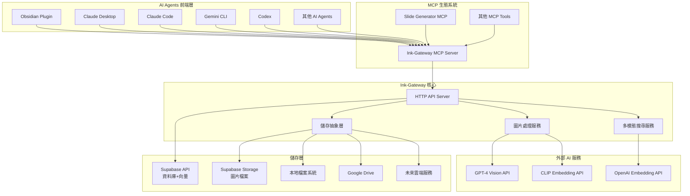

# 多模態 MCP 系統設計文件

## 概述

本設計文件描述如何將現有的 Ink-Gateway 系統擴展為支援多模態（文字+圖片）的知識管理系統，並透過 MCP (Model Context Protocol) 提供統一的存取介面。設計重點在於最小化對現有架構的影響，同時提供強大的圖片處理和語義搜尋能力。

## 架構設計

### 整體架構圖



### 核心設計原則

1. **最小侵入性**: 擴展現有 UnifiedChunk 模型，不破壞現有功能
2. **可插拔架構**: 儲存、AI 服務都採用介面設計，易於擴展
3. **效能優先**: 批次處理、快取機制、並行處理
4. **Supabase 優先**: 圖片儲存使用 self-hosted Supabase Storage
5. **MCP 標準**: 完全符合 MCP 協議規範

### 功能分類

#### 🔧 擴展現有功能：
- **向量搜尋**: 擴展現有 embeddings 表支援圖片向量
- **搜尋服務**: 擴展現有 SearchService 支援多模態搜尋
- **資料模型**: 擴展 UnifiedChunk.metadata 支援圖片資訊

#### ✨ 全新功能：
- **Supabase Storage 整合**: 全新的檔案儲存功能
- **Vision AI 服務**: GPT-4 Vision 和 CLIP 整合
- **MCP Server**: 完整的 MCP 協議實作
- **圖片批次處理**: 資料夾掃描和批次上傳功能
- **多模態搜尋**: 文字+圖片混合搜尋演算法

## 組件和介面

### 1. 資料模型擴展

#### 1.1 UnifiedChunk 元資料擴展

現有的 `UnifiedChunk.metadata` 欄位將用於儲存圖片相關資訊：

```json
{
  "media_type": "image",
  "storage": {
    "type": "local|google_drive|google_photos|nas",
    "storage_id": "unique-storage-identifier",
    "url": "accessible-url",
    "original_filename": "user-friendly-name.png",
    "file_hash": "sha256-hash-for-deduplication",
    "uploaded_at": "2025-01-15T10:30:00Z"
  },
  "image_properties": {
    "format": "png|jpg|jpeg|gif|webp",
    "size_bytes": 102400,
    "width": 1920,
    "height": 1080,
    "mime_type": "image/png"
  },
  "ai_analysis": {
    "description": "AI 生成的詳細圖片描述",
    "model": "gpt-4-vision-preview",
    "tags": ["architecture", "microservices", "diagram"],
    "analyzed_at": "2025-01-15T10:30:05Z",
    "confidence": 0.95
  },
  "embeddings": {
    "image": {
      "model": "clip-vit-b-32",
      "dimensions": 512,
      "embedding_id": "embedding-uuid-1"
    },
    "text": {
      "model": "text-embedding-3-small", 
      "dimensions": 512,
      "embedding_id": "embedding-uuid-2"
    }
  }
}
```

#### 1.2 Embeddings 表擴展

需要擴展現有的 embeddings 表以支援多種向量類型：

```sql
-- 擴展 embeddings 表
ALTER TABLE embeddings 
ADD COLUMN vector_type VARCHAR(50) NOT NULL DEFAULT 'text',
ADD COLUMN model_name VARCHAR(100) NOT NULL DEFAULT 'text-embedding-3-small',
ADD COLUMN metadata JSONB;

-- 建立索引
CREATE INDEX idx_embeddings_vector_type ON embeddings(vector_type);
CREATE INDEX idx_embeddings_model ON embeddings(model_name);
CREATE INDEX idx_text_vectors ON embeddings USING ivfflat (vector vector_cosine_ops) 
WHERE vector_type = 'text';
CREATE INDEX idx_image_vectors ON embeddings USING ivfflat (vector vector_cosine_ops) 
WHERE vector_type = 'image';
```

### 2. 儲存抽象層設計

#### 2.0 儲存策略選擇

我們提供多種儲存選項，各有優缺點：

| 儲存方式 | 優點 | 缺點 | 適用情境 |
|---------|------|------|----------|
| **Supabase Storage** | 與資料庫整合、CDN支援、權限控制 | 1GB免費額度、被綁定 | 小型專案、快速開發 |
| **Google Drive** | 15GB免費空間、熟悉介面、跨裝置同步 | API配額限制、速度較慢 | 個人使用、大量圖片 |
| **本地檔案系統** | 速度快、無限制、完全控制 | 無跨裝置同步、無備份 | 開發測試、離線使用 |
| **NAS/自建** | 完全控制、大容量、高速 | 需要維護、複雜設定 | 企業使用、大量資料 |

**建議的實作順序**：
1. **第一期**: Supabase Storage (主要儲存) + 本地儲存 (開發測試/離線備份)
2. **第二期**: Google Drive (可選，作為額外備份或遷移選項)
3. **第三期**: NAS 支援 (企業需求或特殊情境)

**配置範例**：
```yaml
storage:
  primary: "supabase"     # 主要儲存（你的 self-hosted）
  fallback: "local"       # 備用儲存（開發測試）
  supabase:
    url: "https://your-supabase-server.com"
    bucket: "ink-images"
    # 統一的圖片儲存位置，取代 Google Drive 的角色
    # 所有專案圖片都存在這裡：
    # /ink-images/obsidian/notes/
    # /ink-images/vscode/projects/
    # /ink-images/general/screenshots/
  local:
    base_path: "/tmp/ink-images"  # 開發測試用
    base_url: "file:///tmp/ink-images"
```

#### 2.1 StorageAdapter 介面

```go
// MediaStorageAdapter 定義統一的儲存介面
type MediaStorageAdapter interface {
    // 上傳檔案並返回儲存資訊
    Upload(ctx context.Context, file io.Reader, metadata *MediaMetadata) (*StorageResult, error)
    
    // 根據 storage_id 取得存取 URL
    GetURL(ctx context.Context, storageID string) (string, error)
    
    // 下載檔案內容
    Download(ctx context.Context, storageID string) (io.ReadCloser, error)
    
    // 刪除檔案
    Delete(ctx context.Context, storageID string) error
    
    // 掃描資料夾中的圖片檔案
    ScanFolder(ctx context.Context, folderPath string) ([]MediaFile, error)
    
    // 取得儲存類型
    GetStorageType() StorageType
    
    // 健康檢查
    HealthCheck(ctx context.Context) error
}

// MediaMetadata 圖片元資料
type MediaMetadata struct {
    OriginalFilename string
    ContentType      string
    Size            int64
    Width           int
    Height          int
    Hash            string // SHA256
}

// StorageResult 上傳結果
type StorageResult struct {
    StorageID   string
    URL         string
    StorageType StorageType
    UploadedAt  time.Time
}

// StorageType 儲存類型
type StorageType string

const (
    StorageTypeLocal        StorageType = "local"
    StorageTypeSupabase     StorageType = "supabase"
    StorageTypeGoogleDrive  StorageType = "google_drive"
    StorageTypeGooglePhotos StorageType = "google_photos"
    StorageTypeNAS          StorageType = "nas"
)
```

#### 2.2 儲存實作選項

我們提供多種儲存實作，包括 Supabase Storage：

```go
// SupabaseStorageAdapter Supabase Storage 實作
type SupabaseStorageAdapter struct {
    client    *supabase.Client
    bucket    string
    baseURL   string
}

func (s *SupabaseStorageAdapter) Upload(ctx context.Context, file io.Reader, metadata *MediaMetadata) (*StorageResult, error) {
    // 1. 生成檔案路徑 (使用 hash 避免重複)
    filePath := fmt.Sprintf("images/%s/%s_%s", 
        time.Now().Format("2006/01"), 
        metadata.Hash[:16],
        metadata.OriginalFilename)
    
    // 2. 上傳到 Supabase Storage
    resp, err := s.client.Storage.
        From(s.bucket).
        Upload(filePath, file, supabase.FileOptions{
            ContentType: &metadata.ContentType,
            Upsert:      false, // 不覆蓋現有檔案
        })
    
    if err != nil {
        return nil, fmt.Errorf("supabase upload failed: %w", err)
    }
    
    // 3. 取得公開 URL
    publicURL := s.client.Storage.From(s.bucket).GetPublicURL(filePath)
    
    return &StorageResult{
        StorageID:   filePath,
        URL:         publicURL.SignedURL,
        StorageType: StorageTypeSupabase,
        UploadedAt:  time.Now(),
    }, nil
}

// LocalStorageAdapter 本地檔案系統實作
type LocalStorageAdapter struct {
    basePath string
    baseURL  string
}

// GoogleDriveAdapter Google Drive 實作 (未來)
type GoogleDriveAdapter struct {
    service  *drive.Service
    folderID string
}

func (l *LocalStorageAdapter) Upload(ctx context.Context, file io.Reader, metadata *MediaMetadata) (*StorageResult, error) {
    // 1. 生成唯一檔名 (使用 hash + 時間戳)
    storageID := fmt.Sprintf("%s_%d%s", 
        metadata.Hash[:16], 
        time.Now().Unix(), 
        filepath.Ext(metadata.OriginalFilename))
    
    // 2. 建立目錄結構 (按日期分組)
    dateDir := time.Now().Format("2006/01/02")
    fullDir := filepath.Join(l.basePath, dateDir)
    os.MkdirAll(fullDir, 0755)
    
    // 3. 儲存檔案
    destPath := filepath.Join(fullDir, storageID)
    destFile, err := os.Create(destPath)
    if err != nil {
        return nil, fmt.Errorf("failed to create file: %w", err)
    }
    defer destFile.Close()
    
    _, err = io.Copy(destFile, file)
    if err != nil {
        return nil, fmt.Errorf("failed to write file: %w", err)
    }
    
    // 4. 返回結果
    return &StorageResult{
        StorageID:   filepath.Join(dateDir, storageID),
        URL:         fmt.Sprintf("%s/%s/%s", l.baseURL, dateDir, storageID),
        StorageType: StorageTypeLocal,
        UploadedAt:  time.Now(),
    }, nil
}
```

### 3. 圖片處理服務

#### 3.1 MediaProcessor 介面

```go
// MediaProcessor 圖片處理服務介面
type MediaProcessor interface {
    // 處理單張圖片（上傳、分析、索引）
    ProcessImage(ctx context.Context, req *ProcessImageRequest) (*ProcessImageResult, error)
    
    // 批次處理圖片
    BatchProcessImages(ctx context.Context, req *BatchProcessRequest) (*BatchProcessResult, error)
    
    // 分析圖片內容
    AnalyzeImage(ctx context.Context, imageURL string) (*ImageAnalysis, error)
    
    // 生成圖片向量
    GenerateImageEmbedding(ctx context.Context, imageURL string) ([]float64, error)
    
    // 計算檔案雜湊
    CalculateHash(ctx context.Context, file io.Reader) (string, error)
}

// ProcessImageRequest 圖片處理請求
type ProcessImageRequest struct {
    File             io.Reader
    OriginalFilename string
    PageID          *string
    Tags            []string
    AutoAnalyze     bool
    AutoEmbed       bool
    StorageType     StorageType
}

// ProcessImageResult 圖片處理結果
type ProcessImageResult struct {
    ChunkID      string
    StorageID    string
    URL          string
    Hash         string
    Analysis     *ImageAnalysis
    EmbeddingIDs map[string]string // "image" -> embedding_id, "text" -> embedding_id
}

// ImageAnalysis AI 圖片分析結果
type ImageAnalysis struct {
    Description string
    Tags        []string
    Model       string
    Confidence  float64
    AnalyzedAt  time.Time
}
```

#### 3.2 Vision AI 整合

```go
// VisionAIService Vision AI 服務介面
type VisionAIService interface {
    AnalyzeImage(ctx context.Context, imageURL string, options *AnalysisOptions) (*ImageAnalysis, error)
}

// AnalysisOptions 分析選項
type AnalysisOptions struct {
    DetailLevel string // "low", "medium", "high"
    Language    string // "zh-TW", "en"
    MaxTokens   int
}

// GPT4VisionService GPT-4 Vision 實作
type GPT4VisionService struct {
    apiKey     string
    httpClient *http.Client
}

func (g *GPT4VisionService) AnalyzeImage(ctx context.Context, imageURL string, options *AnalysisOptions) (*ImageAnalysis, error) {
    prompt := `請詳細描述這張圖片的內容，包括：
1. 主要物件和元素
2. 圖片類型（截圖、圖表、照片等）
3. 技術相關內容（如果有的話）
4. 可能的用途或情境
5. 建議的標籤（用逗號分隔）

請用繁體中文回答。`

    // 構建 GPT-4 Vision API 請求
    request := map[string]interface{}{
        "model": "gpt-4-vision-preview",
        "messages": []map[string]interface{}{
            {
                "role": "user",
                "content": []map[string]interface{}{
                    {
                        "type": "text",
                        "text": prompt,
                    },
                    {
                        "type": "image_url",
                        "image_url": map[string]string{
                            "url": imageURL,
                        },
                    },
                },
            },
        },
        "max_tokens": options.MaxTokens,
    }
    
    // 執行 API 呼叫並解析結果
    // ... 實作細節
}
```

### 4. 多模態搜尋服務

#### 4.1 MultimodalSearchService 介面

```go
// MultimodalSearchService 多模態搜尋服務
type MultimodalSearchService interface {
    // 文字搜尋（包含圖片 AI 描述）
    SearchText(ctx context.Context, req *TextSearchRequest) (*SearchResponse, error)
    
    // 圖片搜尋（向量相似度）
    SearchImages(ctx context.Context, req *ImageSearchRequest) (*SearchResponse, error)
    
    // 混合搜尋（文字+圖片）
    HybridSearch(ctx context.Context, req *HybridSearchRequest) (*SearchResponse, error)
    
    // 以圖搜圖
    SearchByImage(ctx context.Context, req *ImageSimilarityRequest) (*SearchResponse, error)
    
    // 為 Slide Generator 推薦圖片
    RecommendImagesForSlides(ctx context.Context, req *SlideImageRequest) (*ImageRecommendationResponse, error)
}

// HybridSearchRequest 混合搜尋請求
type HybridSearchRequest struct {
    TextQuery    string
    ImageQuery   string // 圖片 URL 或 base64
    Weights      SearchWeights
    Filters      SearchFilters
    Limit        int
    MinSimilarity float64
}

// SearchWeights 搜尋權重
type SearchWeights struct {
    Text  float64 // 0.0 - 1.0
    Image float64 // 0.0 - 1.0
}

// SearchFilters 搜尋過濾器
type SearchFilters struct {
    MediaType    *string   // "image", "text", "all"
    StorageType  *string   // "local", "google_drive"
    Tags         []string
    DateRange    *DateRange
    ImageFormat  *string   // "png", "jpg"
    MinImageSize *int64
}

// SearchResponse 搜尋回應
type SearchResponse struct {
    Results     []SearchResult
    TotalCount  int
    SearchTime  time.Duration
    Query       string
    MatchTypes  []string // ["text_vector", "image_vector", "hybrid"]
}

// SearchResult 搜尋結果項目
type SearchResult struct {
    Chunk       *models.UnifiedChunkRecord
    Similarity  float64
    MatchType   string // "text_vector", "image_vector", "hybrid"
    Explanation string // 匹配原因說明
}
```

### 5. MCP Server 設計

#### 5.1 MCP Tools 定義

```go
// MCP Tools 實作
var MCPTools = map[string]MCPTool{
    "ink_search_chunks": &SearchChunksTool{},
    "ink_create_chunk": &CreateChunkTool{},
    "ink_analyze_image": &AnalyzeImageTool{},
    "ink_batch_process_images": &BatchProcessImagesTool{},
    "ink_get_images_for_slides": &GetImagesForSlidesTool{},
    "ink_upload_image": &UploadImageTool{},
    "ink_search_images": &SearchImagesTool{},
    "ink_hybrid_search": &HybridSearchTool{},
}

// SearchChunksTool 搜尋知識塊工具
type SearchChunksTool struct{}

func (t *SearchChunksTool) Execute(ctx context.Context, args map[string]interface{}) (*MCPResult, error) {
    // 解析參數
    query := args["query"].(string)
    searchType := getStringArg(args, "type", "all") // "text", "image", "all"
    limit := getIntArg(args, "limit", 10)
    minSimilarity := getFloatArg(args, "min_similarity", 0.7)
    includeImages := getBoolArg(args, "include_images", true)
    
    // 根據搜尋類型執行不同的搜尋
    switch searchType {
    case "text":
        return t.searchText(ctx, query, limit, minSimilarity)
    case "image":
        return t.searchImages(ctx, query, limit, minSimilarity)
    case "all", "hybrid":
        return t.hybridSearch(ctx, query, limit, minSimilarity, includeImages)
    default:
        return nil, fmt.Errorf("unsupported search type: %s", searchType)
    }
}

// AnalyzeImageTool 圖片分析工具
type AnalyzeImageTool struct{}

func (t *AnalyzeImageTool) Execute(ctx context.Context, args map[string]interface{}) (*MCPResult, error) {
    imageURL := args["image_url"].(string)
    generateEmbedding := getBoolArg(args, "generate_embedding", true)
    detailLevel := getStringArg(args, "detail_level", "medium")
    
    // 分析圖片
    analysis, err := mediaProcessor.AnalyzeImage(ctx, imageURL)
    if err != nil {
        return nil, fmt.Errorf("failed to analyze image: %w", err)
    }
    
    result := map[string]interface{}{
        "description": analysis.Description,
        "tags":        analysis.Tags,
        "model":       analysis.Model,
        "confidence":  analysis.Confidence,
    }
    
    // 生成向量（如果需要）
    if generateEmbedding {
        embedding, err := mediaProcessor.GenerateImageEmbedding(ctx, imageURL)
        if err != nil {
            return nil, fmt.Errorf("failed to generate embedding: %w", err)
        }
        
        // 儲存向量到資料庫
        embeddingID, err := storeEmbedding(ctx, embedding, "image", "clip-vit-b-32")
        if err != nil {
            return nil, fmt.Errorf("failed to store embedding: %w", err)
        }
        
        result["embedding_id"] = embeddingID
    }
    
    return &MCPResult{
        Content: []MCPContent{{
            Type: "text",
            Text: fmt.Sprintf("圖片分析完成：%s", analysis.Description),
        }},
        IsError: false,
    }, nil
}

// GetImagesForSlidesTool Slide Generator 圖片推薦工具
type GetImagesForSlidesTool struct{}

func (t *GetImagesForSlidesTool) Execute(ctx context.Context, args map[string]interface{}) (*MCPResult, error) {
    textContent := args["text_content"].(string)
    maxSuggestions := getIntArg(args, "max_suggestions", 5)
    context := getStringArg(args, "context", "")
    
    // 建立推薦請求
    req := &SlideImageRequest{
        TextContent:    textContent,
        Context:        context,
        MaxSuggestions: maxSuggestions,
        MinRelevance:   0.7,
    }
    
    // 執行推薦
    recommendations, err := multimodalSearch.RecommendImagesForSlides(ctx, req)
    if err != nil {
        return nil, fmt.Errorf("failed to get image recommendations: %w", err)
    }
    
    // 格式化結果
    suggestions := make([]map[string]interface{}, len(recommendations.Suggestions))
    for i, suggestion := range recommendations.Suggestions {
        suggestions[i] = map[string]interface{}{
            "chunk_id":        suggestion.ChunkID,
            "image_url":       suggestion.ImageURL,
            "description":     suggestion.Description,
            "relevance_score": suggestion.RelevanceScore,
            "reason":          suggestion.Reason,
        }
    }
    
    return &MCPResult{
        Content: []MCPContent{{
            Type: "text",
            Text: fmt.Sprintf("找到 %d 個相關圖片建議", len(suggestions)),
        }},
        IsError: false,
    }, nil
}
```

## 資料模型

### 1. 現有模型保持不變

現有的 `UnifiedChunkRecord` 結構保持完全不變，所有圖片相關資訊都儲存在 `metadata` 欄位中。

### 2. 新增輔助模型

```go
// MediaFile 掃描到的媒體檔案
type MediaFile struct {
    Path         string
    Filename     string
    Size         int64
    ModifiedAt   time.Time
    ContentType  string
    Hash         string
}

// BatchProcessStatus 批次處理狀態
type BatchProcessStatus struct {
    BatchID      string
    TotalFiles   int
    ProcessedFiles int
    FailedFiles  int
    Status       string // "processing", "completed", "failed", "paused"
    StartedAt    time.Time
    CompletedAt  *time.Time
    Errors       []BatchError
}

// BatchError 批次處理錯誤
type BatchError struct {
    Filename string
    Error    string
    Timestamp time.Time
}

// ImageRecommendation 圖片推薦
type ImageRecommendation struct {
    ChunkID        string
    ImageURL       string
    Description    string
    RelevanceScore float64
    Reason         string
    Tags           []string
}
```

## 錯誤處理

### 1. 錯誤類型定義

```go
// 多模態系統特定錯誤
var (
    ErrUnsupportedImageFormat = errors.New("unsupported image format")
    ErrImageTooLarge         = errors.New("image file too large")
    ErrStorageNotAvailable   = errors.New("storage service not available")
    ErrVisionAPIFailed       = errors.New("vision API analysis failed")
    ErrEmbeddingFailed       = errors.New("embedding generation failed")
    ErrDuplicateImage        = errors.New("duplicate image detected")
)

// MediaProcessingError 媒體處理錯誤
type MediaProcessingError struct {
    Operation string
    Filename  string
    Cause     error
}

func (e *MediaProcessingError) Error() string {
    return fmt.Sprintf("media processing failed [%s] for file %s: %v", 
        e.Operation, e.Filename, e.Cause)
}
```

### 2. 錯誤處理策略

1. **重試機制**: AI API 呼叫失敗時自動重試
2. **降級處理**: Vision API 失敗時使用檔名作為描述
3. **部分成功**: 批次處理中單個檔案失敗不影響其他檔案
4. **錯誤記錄**: 詳細記錄所有錯誤供後續分析

## 測試策略

### 1. 單元測試

```go
// 儲存適配器測試
func TestLocalStorageAdapter_Upload(t *testing.T) {
    adapter := NewLocalStorageAdapter("/tmp/test", "file:///tmp/test")
    
    // 測試正常上傳
    file := strings.NewReader("test image content")
    metadata := &MediaMetadata{
        OriginalFilename: "test.png",
        ContentType:      "image/png",
        Size:            17,
        Hash:            "test-hash",
    }
    
    result, err := adapter.Upload(context.Background(), file, metadata)
    assert.NoError(t, err)
    assert.NotEmpty(t, result.StorageID)
    assert.Contains(t, result.URL, "test-hash")
}

// 圖片處理服務測試
func TestMediaProcessor_ProcessImage(t *testing.T) {
    processor := NewMediaProcessor(mockStorage, mockVisionAI, mockEmbedding)
    
    req := &ProcessImageRequest{
        File:             mockImageFile(),
        OriginalFilename: "architecture.png",
        AutoAnalyze:     true,
        AutoEmbed:       true,
    }
    
    result, err := processor.ProcessImage(context.Background(), req)
    assert.NoError(t, err)
    assert.NotEmpty(t, result.ChunkID)
    assert.NotEmpty(t, result.Analysis.Description)
}
```

### 2. 整合測試

```go
// MCP 工具整合測試
func TestMCPTools_Integration(t *testing.T) {
    // 設定測試環境
    server := setupTestMCPServer()
    
    // 測試圖片上傳
    uploadArgs := map[string]interface{}{
        "image_path": "testdata/sample.png",
        "auto_analyze": true,
    }
    
    result, err := server.ExecuteTool("ink_upload_image", uploadArgs)
    assert.NoError(t, err)
    
    chunkID := extractChunkID(result)
    
    // 測試搜尋
    searchArgs := map[string]interface{}{
        "query": "architecture diagram",
        "type": "image",
    }
    
    searchResult, err := server.ExecuteTool("ink_search_chunks", searchArgs)
    assert.NoError(t, err)
    assert.Contains(t, searchResult.Content[0].Text, chunkID)
}
```

### 3. 效能測試

```go
// 批次處理效能測試
func BenchmarkBatchProcessing(b *testing.B) {
    processor := NewMediaProcessor(storage, visionAI, embedding)
    
    // 準備測試檔案
    files := generateTestImages(100)
    
    b.ResetTimer()
    for i := 0; i < b.N; i++ {
        req := &BatchProcessRequest{
            Files: files,
            Concurrency: 5,
        }
        
        _, err := processor.BatchProcessImages(context.Background(), req)
        if err != nil {
            b.Fatal(err)
        }
    }
}
```

這個設計文件提供了完整的技術架構，包括：

1. **最小侵入性擴展**: 使用現有 UnifiedChunk 的 metadata 欄位
2. **可插拔儲存**: 支援多種儲存後端的抽象介面
3. **完整的圖片處理流程**: 上傳、分析、向量化、索引
4. **強大的多模態搜尋**: 文字、圖片、混合搜尋
5. **標準 MCP 整合**: 完全符合 MCP 協議的工具定義
6. **全面的錯誤處理**: 重試、降級、部分成功機制
7. **完整的測試策略**: 單元、整合、效能測試

接下來可以進入實作階段，按照設計逐步實現各個組件。