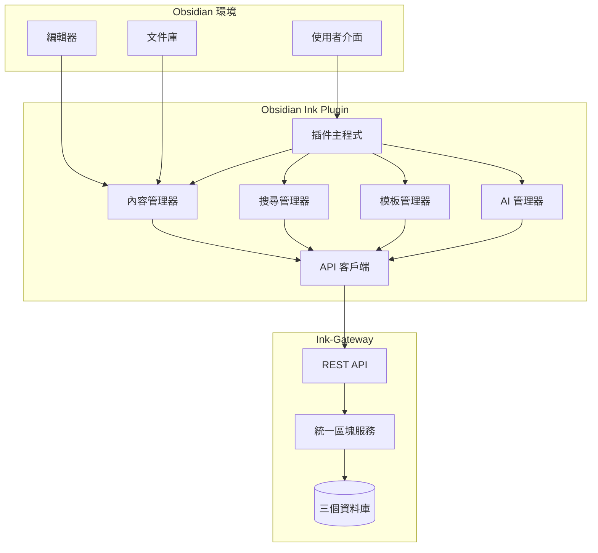

# 設計文件

## 概述

Obsidian Ink Plugin 是一個 TypeScript 開發的 Obsidian 插件，作為 Ink-Gateway 系統的前端介面。該插件提供 AI 聊天、自動內容處理、語義搜尋、模板管理和階層解析功能，透過 REST API 與 Ink-Gateway 後端服務整合。

## 架構

### 整體架構



### 插件架構層級

1. **使用者介面層**：Obsidian 原生 UI 元件和自定義面板
2. **服務層**：核心業務邏輯和狀態管理
3. **API 層**：與 Ink-Gateway 的通訊介面
4. **資料層**：本地快取和同步機制

## 元件和介面

### 1. 插件主程式 (PluginMain)

```typescript
interface ObsidianInkPlugin extends Plugin {
    settings: PluginSettings;
    contentManager: ContentManager;
    searchManager: SearchManager;
    templateManager: TemplateManager;
    aiManager: AIManager;
    apiClient: InkGatewayClient;
    
    onload(): Promise<void>;
    onunload(): void;
    loadSettings(): Promise<void>;
    saveSettings(): Promise<void>;
}

interface PluginSettings {
    inkGatewayUrl: string;
    apiKey: string;
    autoSync: boolean;
    syncInterval: number;
    cacheEnabled: boolean;
    debugMode: boolean;
}
```

### 2. 內容管理器 (ContentManager)

負責處理 Obsidian 內容的解析、同步和管理。

```typescript
interface ContentManager {
    parseContent(content: string, filePath: string): Promise<ParsedContent>;
    syncToInkGateway(chunks: UnifiedChunk[]): Promise<SyncResult>;
    handleContentChange(file: TFile): Promise<void>;
    parseHierarchy(content: string): HierarchyNode[];
    extractMetadata(file: TFile): ContentMetadata;
    
    // 文件 ID 管理功能
    generateDocumentId(filePath: string): string;
    generateVirtualDocumentId(context: VirtualDocumentContext): string;
    getChunksByDocumentId(documentId: string): Promise<UnifiedChunk[]>;
    reconstructDocument(documentId: string): Promise<ReconstructedDocument>;
}

interface ParsedContent {
    chunks: UnifiedChunk[];
    hierarchy: HierarchyNode[];
    metadata: ContentMetadata;
    positions: PositionMap;
}

interface HierarchyNode {
    id: string;
    content: string;
    level: number;
    type: 'heading' | 'bullet';
    parent?: string;
    children: string[];
    position: Position;
}

interface Position {
    fileName: string;
    lineStart: number;
    lineEnd: number;
    charStart: number;
    charEnd: number;
}
```

### 3. 搜尋管理器 (SearchManager)

提供語義搜尋功能和結果展示。

```typescript
interface SearchManager {
    performSearch(query: SearchQuery): Promise<SearchResult>;
    displayResults(results: SearchResult): void;
    navigateToResult(result: SearchResultItem): void;
    createSearchView(): SearchView;
}

interface SearchQuery {
    content?: string;
    tags?: string[];
    tagLogic?: 'AND' | 'OR';
    filters?: SearchFilters;
    searchType: 'semantic' | 'exact' | 'fuzzy';
}

interface SearchResult {
    items: SearchResultItem[];
    totalCount: number;
    searchTime: number;
    cacheHit: boolean;
}

interface SearchResultItem {
    chunk: UnifiedChunk;
    score: number;
    context: string;
    position: Position;
    highlights: TextHighlight[];
}
```

### 4. 模板管理器 (TemplateManager)

處理模板的建立、應用和管理。

```typescript
interface TemplateManager {
    createTemplate(name: string, structure: TemplateStructure): Promise<Template>;
    applyTemplate(templateId: string, targetFile: TFile): Promise<void>;
    parseTemplateFromContent(content: string): Template;
    getTemplateInstances(templateId: string): Promise<TemplateInstance[]>;
}

interface Template {
    id: string;
    name: string;
    slots: TemplateSlot[];
    structure: TemplateStructure;
    metadata: TemplateMetadata;
}

interface TemplateSlot {
    id: string;
    name: string;
    type: 'text' | 'number' | 'date' | 'link' | 'tag';
    required: boolean;
    defaultValue?: any;
    validation?: ValidationRule;
}

interface TemplateInstance {
    id: string;
    templateId: string;
    filePath: string;
    slotValues: Record<string, any>;
    createdAt: Date;
    updatedAt: Date;
}
```

### 5. AI 管理器 (AIManager)

處理 AI 聊天功能和智能內容處理。

```typescript
interface AIManager {
    sendMessage(message: string): Promise<AIResponse>;
    processContent(content: string): Promise<ProcessingResult>;
    createChatView(): ChatView;
    maintainChatHistory(): void;
}

interface AIResponse {
    message: string;
    suggestions?: ContentSuggestion[];
    actions?: AIAction[];
    metadata: ResponseMetadata;
}

interface ProcessingResult {
    chunks: UnifiedChunk[];
    suggestions: ContentSuggestion[];
    improvements: ContentImprovement[];
}
```

### 6. API 客戶端 (InkGatewayClient)

與 Ink-Gateway 後端服務的通訊介面。

```typescript
interface InkGatewayClient {
    // 區塊操作
    createChunk(chunk: UnifiedChunk): Promise<UnifiedChunk>;
    updateChunk(id: string, chunk: Partial<UnifiedChunk>): Promise<UnifiedChunk>;
    deleteChunk(id: string): Promise<void>;
    getChunk(id: string): Promise<UnifiedChunk>;
    batchCreateChunks(chunks: UnifiedChunk[]): Promise<UnifiedChunk[]>;
    
    // 搜尋操作
    searchChunks(query: SearchQuery): Promise<SearchResult>;
    searchSemantic(content: string): Promise<SearchResult>;
    searchByTags(tags: string[]): Promise<SearchResult>;
    
    // 階層操作
    getHierarchy(rootId: string): Promise<HierarchyNode[]>;
    updateHierarchy(relations: HierarchyRelation[]): Promise<void>;
    
    // AI 操作
    chatWithAI(message: string, context?: string[]): Promise<AIResponse>;
    processContent(content: string): Promise<ProcessingResult>;
    
    // 模板操作
    createTemplate(template: Template): Promise<Template>;
    getTemplateInstances(templateId: string): Promise<TemplateInstance[]>;
    
    // 文件 ID 分頁操作
    getChunksByDocumentId(documentId: string, options?: PaginationOptions): Promise<DocumentChunksResult>;
    createVirtualDocument(context: VirtualDocumentContext): Promise<VirtualDocument>;
    updateDocumentScope(chunkId: string, documentId: string, scope: DocumentScope): Promise<void>;
}
```

## 資料模型

### 統一區塊 (UnifiedChunk)

```typescript
interface UnifiedChunk {
    chunkId: string;
    contents: string;
    parent?: string;
    page?: string;
    isPage: boolean;
    isTag: boolean;
    isTemplate: boolean;
    isSlot: boolean;
    ref?: string;
    tags: string[];
    metadata: Record<string, any>;
    createdTime: Date;
    lastUpdated: Date;
    
    // Obsidian 特定欄位
    position: Position;
    filePath: string;
    obsidianMetadata: ObsidianMetadata;
    
    // 文件 ID 分頁功能
    documentId: string;
    virtualDocumentId?: string;
    documentScope: 'file' | 'virtual' | 'page';
}

interface ObsidianMetadata {
    properties: Record<string, any>;
    frontmatter: Record<string, any>;
    aliases: string[];
    cssClasses: string[];
}

// 文件 ID 分頁相關介面
interface VirtualDocumentContext {
    sourceType: 'remnote' | 'logseq' | 'obsidian-template';
    contextId: string;
    pageTitle?: string;
    metadata: Record<string, any>;
}

interface VirtualDocument {
    virtualDocumentId: string;
    context: VirtualDocumentContext;
    chunkIds: string[];
    createdAt: Date;
    lastUpdated: Date;
}

interface ReconstructedDocument {
    documentId: string;
    chunks: UnifiedChunk[];
    hierarchy: HierarchyNode[];
    metadata: DocumentMetadata;
    reconstructionTime: Date;
}

interface DocumentMetadata {
    originalFilePath?: string;
    virtualContext?: VirtualDocumentContext;
    totalChunks: number;
    documentScope: DocumentScope;
    lastModified: Date;
}

interface PaginationOptions {
    page?: number;
    pageSize?: number;
    includeHierarchy?: boolean;
    sortBy?: 'position' | 'created' | 'updated';
    sortOrder?: 'asc' | 'desc';
}

interface DocumentChunksResult {
    chunks: UnifiedChunk[];
    pagination: {
        currentPage: number;
        totalPages: number;
        totalChunks: number;
        pageSize: number;
    };
    documentMetadata: DocumentMetadata;
}

type DocumentScope = 'file' | 'virtual' | 'page';
```

### 同步狀態

```typescript
interface SyncState {
    lastSyncTime: Date;
    pendingChanges: PendingChange[];
    conflictResolution: ConflictResolution;
    syncStatus: 'idle' | 'syncing' | 'error' | 'offline';
}

interface PendingChange {
    id: string;
    type: 'create' | 'update' | 'delete';
    chunk: UnifiedChunk;
    timestamp: Date;
    retryCount: number;
}
```

## 錯誤處理

### 錯誤類型

```typescript
enum ErrorType {
    NETWORK_ERROR = 'network_error',
    API_ERROR = 'api_error',
    PARSING_ERROR = 'parsing_error',
    SYNC_ERROR = 'sync_error',
    VALIDATION_ERROR = 'validation_error'
}

interface PluginError extends Error {
    type: ErrorType;
    code: string;
    details?: any;
    recoverable: boolean;
}
```

### 錯誤處理策略

1. **網路錯誤**：自動重試機制，指數退避
2. **API 錯誤**：記錄錯誤，顯示使用者友好訊息
3. **解析錯誤**：跳過問題內容，記錄詳細資訊
4. **同步錯誤**：排隊重試，衝突解決
5. **驗證錯誤**：即時回饋，阻止無效操作

### 離線處理

```typescript
interface OfflineManager {
    isOnline(): boolean;
    queueOperation(operation: OfflineOperation): void;
    syncWhenOnline(): Promise<void>;
    handleConflicts(conflicts: SyncConflict[]): Promise<void>;
}

interface OfflineOperation {
    id: string;
    type: 'create' | 'update' | 'delete';
    data: any;
    timestamp: Date;
    priority: number;
}
```

## 測試策略

### 單元測試

- **內容解析器測試**：測試 Markdown 解析和階層提取
- **API 客戶端測試**：模擬 HTTP 請求和回應
- **模板引擎測試**：驗證模板建立和應用
- **搜尋功能測試**：測試各種搜尋場景

### 整合測試

- **端到端同步測試**：驗證 Obsidian 到 Ink-Gateway 的完整流程
- **UI 互動測試**：測試使用者介面元件
- **效能測試**：大量資料處理和搜尋效能
- **離線模式測試**：網路中斷和恢復場景

### 測試工具

```typescript
interface TestUtils {
    createMockVault(): MockVault;
    createMockFile(content: string): MockFile;
    mockInkGatewayAPI(): MockAPIClient;
    simulateUserInteraction(action: UserAction): Promise<void>;
}
```

## 效能考量

### 快取策略

1. **搜尋結果快取**：本地儲存常用搜尋結果
2. **內容快取**：快取已解析的內容結構
3. **API 回應快取**：減少重複 API 呼叫
4. **模板快取**：快取模板定義和實例

### 最佳化措施

1. **延遲載入**：按需載入大型內容
2. **批次處理**：合併多個 API 請求
3. **增量同步**：只同步變更的內容
4. **背景處理**：非阻塞的內容處理

### 記憶體管理

```typescript
interface MemoryManager {
    cleanupCache(): void;
    monitorMemoryUsage(): MemoryStats;
    optimizePerformance(): void;
}

interface MemoryStats {
    totalMemory: number;
    usedMemory: number;
    cacheSize: number;
    pendingOperations: number;
}
```

## 安全性

### 資料保護

1. **API 金鑰管理**：安全儲存和傳輸
2. **資料加密**：敏感資料本地加密
3. **輸入驗證**：防止注入攻擊
4. **權限控制**：最小權限原則

### 隱私考量

1. **本地處理優先**：盡可能在本地處理資料
2. **使用者同意**：明確的資料使用同意
3. **資料最小化**：只傳輸必要資料
4. **透明度**：清楚說明資料使用方式

## 部署和分發

### 插件打包

```typescript
interface BuildConfig {
    entry: string;
    output: {
        path: string;
        filename: string;
    };
    externals: string[];
    optimization: OptimizationConfig;
}
```

### 版本管理

1. **語義化版本**：遵循 SemVer 規範
2. **向後相容性**：維護 API 相容性
3. **遷移指南**：提供升級說明
4. **回滾機制**：支援版本回滾

### 發布流程

1. **自動化測試**：CI/CD 管道
2. **程式碼審查**：同儕審查機制
3. **Beta 測試**：社群測試回饋
4. **正式發布**：Obsidian 社群插件商店