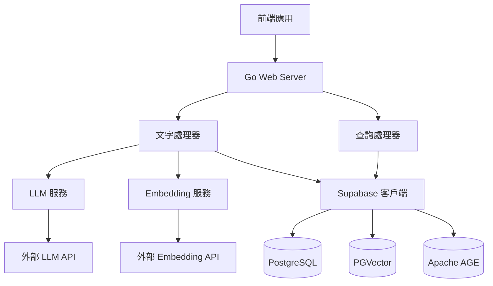

# Design Document

## Overview

這個系統是一個基於 Go 語言的 web 應用程式，專門處理文字內容的語義分析和多資料庫儲存。系統採用微服務架構設計，透過 Supabase API 與資料庫互動，整合 LLM 和 Embeddings 服務，提供完整的文字處理、儲存和查詢功能。

核心設計原則：
- 模組化架構，各組件職責分離
- 透過 Supabase API 統一資料存取
- 非同步處理提升效能
- 完整的錯誤處理和重試機制
- RESTful API 設計

## Architecture

### 系統架構圖



### 分層架構

1. **API Layer** - HTTP 路由和中介軟體
2. **Service Layer** - 業務邏輯處理
3. **Integration Layer** - 外部服務整合
4. **Data Access Layer** - Supabase API 客戶端

## Components and Interfaces

### 1. HTTP Server 和路由

```go
// 主要的 HTTP 路由結構
type Router struct {
    textHandler     *TextHandler
    queryHandler    *QueryHandler
    templateHandler *TemplateHandler
    middleware      []Middleware
}

// API 端點設計
POST   /api/v1/texts                    // 提交文字進行處理
GET    /api/v1/texts                    // 列出文字（支援分頁）
GET    /api/v1/texts/{id}               // 取得特定文字詳情

// 模板相關 API
POST   /api/v1/templates                // 創建模板（通訊錄#template + slots）
GET    /api/v1/templates                // 列出所有模板
GET    /api/v1/templates/{content}      // 根據模板內容取得模板和實例
POST   /api/v1/templates/{id}/instances // 創建模板實例（Leo#通訊錄）
PUT    /api/v1/instances/{id}/slots     // 更新實例的 slot 值

// 標籤相關 API
POST   /api/v1/chunks/{id}/tags         // 為 chunk 添加標籤
DELETE /api/v1/chunks/{id}/tags/{tagId} // 移除 chunk 的標籤
GET    /api/v1/chunks/{id}/tags         // 取得 chunk 的所有標籤
GET    /api/v1/tags/{content}/chunks    // 根據標籤內容取得所有相關 chunks

// Chunk 操作 API
GET    /api/v1/chunks                   // 列出 chunks（支援篩選）
GET    /api/v1/chunks/{id}              // 取得特定 chunk
PUT    /api/v1/chunks/{id}              // 更新 chunk
POST   /api/v1/chunks                   // 創建新 chunk
DELETE /api/v1/chunks/{id}              // 刪除 chunk

// 層級結構 API
GET    /api/v1/chunks/{id}/hierarchy    // 取得 chunk 的完整層級結構
GET    /api/v1/chunks/{id}/children     // 取得 chunk 的直接子項目
GET    /api/v1/chunks/{id}/siblings     // 取得 chunk 的兄弟項目
POST   /api/v1/chunks/{id}/move         // 移動 chunk 到新的位置/層級
PUT    /api/v1/chunks/bulk-update       // 批量更新 chunks（前端編輯器使用）

// 前端編輯器專用 API
GET    /api/v1/texts/{id}/structure     // 取得文字的完整 bullet 結構
PUT    /api/v1/texts/{id}/structure     // 更新文字的 bullet 結構

// 搜尋 API
POST   /api/v1/search/semantic          // 語義搜尋
POST   /api/v1/search/graph             // 圖形搜尋
POST   /api/v1/search/tags              // 根據標籤搜尋
POST   /api/v1/search/chunks            // 一般文字搜尋

GET    /api/v1/health                   // 健康檢查
```

### 2. 文字處理服務

```go
type TextProcessor interface {
    ProcessText(ctx context.Context, text string) (*ProcessResult, error)
    ChunkText(ctx context.Context, text string) ([]Chunk, error)
    GenerateEmbeddings(ctx context.Context, chunks []Chunk) ([]EmbeddedChunk, error)
    ExtractKnowledge(ctx context.Context, chunks []Chunk) (*KnowledgeGraph, error)
}

type ProcessResult struct {
    TextID     string    `json:"text_id"`
    Chunks     []Chunk   `json:"chunks"`
    Status     string    `json:"status"`
    ProcessedAt time.Time `json:"processed_at"`
}
```

### 3. Supabase 客戶端

```go
type SupabaseClient interface {
    // 基本 Chunks 操作
    InsertText(ctx context.Context, text *TextRecord) error
    InsertChunk(ctx context.Context, chunk *ChunkRecord) error
    InsertChunks(ctx context.Context, chunks []ChunkRecord) error
    GetTexts(ctx context.Context, pagination *Pagination) (*TextList, error)
    GetTextByID(ctx context.Context, id string) (*TextDetail, error)
    GetChunkByID(ctx context.Context, id string) (*ChunkRecord, error)
    GetChunkByContent(ctx context.Context, content string) (*ChunkRecord, error)
    UpdateChunk(ctx context.Context, chunk *ChunkRecord) error
    
    // 模板操作
    CreateTemplate(ctx context.Context, templateName string, slotNames []string) (*TemplateWithInstances, error)
    GetTemplateByContent(ctx context.Context, templateContent string) (*TemplateWithInstances, error)
    GetAllTemplates(ctx context.Context) ([]TemplateWithInstances, error)
    
    // 模板實例操作
    CreateTemplateInstance(ctx context.Context, req *CreateInstanceRequest) (*TemplateInstance, error)
    GetTemplateInstances(ctx context.Context, templateChunkID string) ([]TemplateInstance, error)
    UpdateSlotValue(ctx context.Context, instanceChunkID, slotName, value string) error
    
    // 標籤操作
    AddTag(ctx context.Context, chunkID string, tagContent string) error
    RemoveTag(ctx context.Context, chunkID string, tagChunkID string) error
    GetChunkTags(ctx context.Context, chunkID string) ([]ChunkRecord, error)
    GetChunksByTag(ctx context.Context, tagContent string) ([]ChunkRecord, error)
    
    // 層級結構操作
    GetChunkHierarchy(ctx context.Context, rootChunkID string) (*ChunkHierarchy, error)
    GetChildrenChunks(ctx context.Context, parentChunkID string) ([]ChunkRecord, error)
    GetSiblingChunks(ctx context.Context, chunkID string) ([]ChunkRecord, error)
    MoveChunk(ctx context.Context, req *MoveChunkRequest) error
    BulkUpdateChunks(ctx context.Context, req *BulkUpdateRequest) error
    
    // 搜尋操作
    SearchChunks(ctx context.Context, query string, filters map[string]interface{}) ([]ChunkRecord, error)
    SearchByTag(ctx context.Context, tagContent string) ([]ChunkWithTags, error)
    
    // 向量操作
    InsertEmbeddings(ctx context.Context, embeddings []EmbeddingRecord) error
    SearchSimilar(ctx context.Context, queryVector []float64, limit int) ([]SimilarityResult, error)
    
    // 圖形操作
    InsertGraphNodes(ctx context.Context, nodes []GraphNode) error
    InsertGraphEdges(ctx context.Context, edges []GraphEdge) error
    SearchGraph(ctx context.Context, query *GraphQuery) (*GraphResult, error)
}
```

### 4. 外部服務整合

```go
type LLMService interface {
    ChunkText(ctx context.Context, text string) ([]string, error)
    ExtractEntities(ctx context.Context, text string) ([]Entity, error)
}

type EmbeddingService interface {
    GenerateEmbedding(ctx context.Context, text string) ([]float64, error)
    GenerateBatchEmbeddings(ctx context.Context, texts []string) ([][]float64, error)
}
```

## Data Models

### 1. PostgreSQL Tables (透過 Supabase)

#### texts 表
```sql
CREATE TABLE texts (
    id UUID PRIMARY KEY DEFAULT gen_random_uuid(),
    content TEXT NOT NULL,
    title VARCHAR(255),
    created_at TIMESTAMP WITH TIME ZONE DEFAULT NOW(),
    updated_at TIMESTAMP WITH TIME ZONE DEFAULT NOW(),
    status VARCHAR(50) DEFAULT 'processing'
);
```

#### chunks 表 (統一資料表)
```sql
CREATE TABLE chunks (
    id UUID PRIMARY KEY DEFAULT gen_random_uuid(),
    text_id UUID REFERENCES texts(id) ON DELETE CASCADE,
    content TEXT NOT NULL,
    is_template BOOLEAN DEFAULT FALSE, -- 是否為模板
    is_slot BOOLEAN DEFAULT FALSE, -- 是否為 slot
    parent_chunk_id UUID REFERENCES chunks(id), -- 父層 chunk 關係（支援層級結構）
    template_chunk_id UUID REFERENCES chunks(id), -- 指向模板 chunk（當此 chunk 是模板實例時）
    slot_value TEXT, -- 當此 chunk 是 slot 的值時
    indent_level INTEGER DEFAULT 0, -- 縮排層級（前端編輯器使用）
    sequence_number INTEGER, -- 在同一層級中的順序
    metadata JSONB, -- 額外的結構化資料
    created_at TIMESTAMP WITH TIME ZONE DEFAULT NOW(),
    updated_at TIMESTAMP WITH TIME ZONE DEFAULT NOW(),
    
    -- 索引優化
    INDEX idx_chunks_template_id (template_chunk_id),
    INDEX idx_chunks_parent_id (parent_chunk_id),
    INDEX idx_chunks_is_template (is_template),
    INDEX idx_chunks_is_slot (is_slot),
    INDEX idx_chunks_text_id (text_id),
    INDEX idx_chunks_parent_sequence (parent_chunk_id, sequence_number)
);
```

#### chunk_tags 表 (標籤關係表)
```sql
CREATE TABLE chunk_tags (
    id UUID PRIMARY KEY DEFAULT gen_random_uuid(),
    chunk_id UUID REFERENCES chunks(id) ON DELETE CASCADE, -- 被標記的 chunk
    tag_chunk_id UUID REFERENCES chunks(id) ON DELETE CASCADE, -- 作為標籤的 chunk
    created_at TIMESTAMP WITH TIME ZONE DEFAULT NOW(),
    
    -- 確保標籤關係唯一性
    UNIQUE(chunk_id, tag_chunk_id)
);
```

#### template_slots 表 (模板 slot 定義)
```sql
CREATE TABLE template_slots (
    id UUID PRIMARY KEY DEFAULT gen_random_uuid(),
    template_chunk_id UUID REFERENCES chunks(id) ON DELETE CASCADE,
    slot_chunk_id UUID REFERENCES chunks(id) ON DELETE CASCADE,
    slot_order INTEGER DEFAULT 0,
    created_at TIMESTAMP WITH TIME ZONE DEFAULT NOW(),
    
    -- 確保同一模板中 slot 順序唯一
    UNIQUE(template_chunk_id, slot_order)
);
```

### 2. PGVector Tables (透過 Supabase)

#### embeddings 表
```sql
CREATE TABLE embeddings (
    id UUID PRIMARY KEY DEFAULT gen_random_uuid(),
    chunk_id UUID REFERENCES chunks(id) ON DELETE CASCADE,
    vector vector(1536), -- 假設使用 OpenAI embeddings
    created_at TIMESTAMP WITH TIME ZONE DEFAULT NOW()
);

-- 建立向量相似性搜尋索引
CREATE INDEX ON embeddings USING ivfflat (vector vector_cosine_ops);
```

### 3. Apache AGE Tables (透過 Supabase)

#### graph_nodes 表
```sql
CREATE TABLE graph_nodes (
    id UUID PRIMARY KEY DEFAULT gen_random_uuid(),
    chunk_id UUID REFERENCES chunks(id) ON DELETE CASCADE,
    entity_name VARCHAR(255) NOT NULL,
    entity_type VARCHAR(100) NOT NULL,
    properties JSONB,
    created_at TIMESTAMP WITH TIME ZONE DEFAULT NOW()
);
```

#### graph_edges 表
```sql
CREATE TABLE graph_edges (
    id UUID PRIMARY KEY DEFAULT gen_random_uuid(),
    source_node_id UUID REFERENCES graph_nodes(id) ON DELETE CASCADE,
    target_node_id UUID REFERENCES graph_nodes(id) ON DELETE CASCADE,
    relationship_type VARCHAR(100) NOT NULL,
    properties JSONB,
    created_at TIMESTAMP WITH TIME ZONE DEFAULT NOW()
);
```

### 4. Go 資料結構

```go
type TextRecord struct {
    ID        string    `json:"id" db:"id"`
    Content   string    `json:"content" db:"content"`
    Title     string    `json:"title" db:"title"`
    CreatedAt time.Time `json:"created_at" db:"created_at"`
    Status    string    `json:"status" db:"status"`
}

type ChunkRecord struct {
    ID              string                 `json:"id" db:"id"`
    TextID          string                 `json:"text_id" db:"text_id"`
    Content         string                 `json:"content" db:"content"`
    IsTemplate      bool                   `json:"is_template" db:"is_template"`
    IsSlot          bool                   `json:"is_slot" db:"is_slot"`
    ParentChunkID   *string                `json:"parent_chunk_id" db:"parent_chunk_id"`
    TemplateChunkID *string                `json:"template_chunk_id" db:"template_chunk_id"`
    SlotValue       *string                `json:"slot_value" db:"slot_value"`
    IndentLevel     int                    `json:"indent_level" db:"indent_level"`
    SequenceNumber  *int                   `json:"sequence_number" db:"sequence_number"`
    Metadata        map[string]interface{} `json:"metadata" db:"metadata"`
    CreatedAt       time.Time              `json:"created_at" db:"created_at"`
    UpdatedAt       time.Time              `json:"updated_at" db:"updated_at"`
}

type ChunkTag struct {
    ID          string    `json:"id" db:"id"`
    ChunkID     string    `json:"chunk_id" db:"chunk_id"`
    TagChunkID  string    `json:"tag_chunk_id" db:"tag_chunk_id"`
    CreatedAt   time.Time `json:"created_at" db:"created_at"`
}

type TemplateSlot struct {
    ID              string    `json:"id" db:"id"`
    TemplateChunkID string    `json:"template_chunk_id" db:"template_chunk_id"`
    SlotChunkID     string    `json:"slot_chunk_id" db:"slot_chunk_id"`
    SlotOrder       int       `json:"slot_order" db:"slot_order"`
    CreatedAt       time.Time `json:"created_at" db:"created_at"`
}

type EmbeddingRecord struct {
    ID      string    `json:"id" db:"id"`
    ChunkID string    `json:"chunk_id" db:"chunk_id"`
    Vector  []float64 `json:"vector" db:"vector"`
}

type GraphNode struct {
    ID         string                 `json:"id" db:"id"`
    ChunkID    string                 `json:"chunk_id" db:"chunk_id"`
    EntityName string                 `json:"entity_name" db:"entity_name"`
    EntityType string                 `json:"entity_type" db:"entity_type"`
    Properties map[string]interface{} `json:"properties" db:"properties"`
}

// 前端操作相關結構
type CreateTemplateRequest struct {
    TemplateName string   `json:"template_name"`
    SlotNames    []string `json:"slot_names"`
}

type CreateInstanceRequest struct {
    TemplateChunkID string            `json:"template_chunk_id"`
    InstanceName    string            `json:"instance_name"`
    SlotValues      map[string]string `json:"slot_values"` // slot_name -> value
}

type AddTagRequest struct {
    ChunkID    string `json:"chunk_id"`
    TagContent string `json:"tag_content"` // 可以是現有 chunk 的內容或新建的標籤
}

// 查詢結果結構
type TemplateWithInstances struct {
    Template  *ChunkRecord   `json:"template"`
    Slots     []ChunkRecord  `json:"slots"`
    Instances []TemplateInstance `json:"instances"`
}

type TemplateInstance struct {
    Instance   *ChunkRecord            `json:"instance"`
    SlotValues map[string]*ChunkRecord `json:"slot_values"` // slot_name -> value_chunk
}

type ChunkWithTags struct {
    Chunk *ChunkRecord   `json:"chunk"`
    Tags  []ChunkRecord  `json:"tags"`
}

// 層級結構相關
type ChunkHierarchy struct {
    Chunk    *ChunkRecord      `json:"chunk"`
    Children []ChunkHierarchy  `json:"children"`
    Level    int               `json:"level"`
}

type BulletStructure struct {
    RootChunks []ChunkHierarchy `json:"root_chunks"`
    MaxDepth   int              `json:"max_depth"`
}

// 前端編輯器操作
type MoveChunkRequest struct {
    ChunkID        string  `json:"chunk_id"`
    NewParentID    *string `json:"new_parent_id"`    // null 表示移到根層級
    NewPosition    int     `json:"new_position"`     // 在新父層級中的位置
    NewIndentLevel int     `json:"new_indent_level"` // 新的縮排層級
}

type BulkUpdateRequest struct {
    Updates []ChunkUpdate `json:"updates"`
}

type ChunkUpdate struct {
    ChunkID        string  `json:"chunk_id"`
    Content        *string `json:"content,omitempty"`
    ParentChunkID  *string `json:"parent_chunk_id,omitempty"`
    SequenceNumber *int    `json:"sequence_number,omitempty"`
    IndentLevel    *int    `json:"indent_level,omitempty"`
}
```

## Error Handling

### 錯誤類型定義

```go
type ErrorType string

const (
    ErrTypeValidation   ErrorType = "validation"
    ErrTypeExternal     ErrorType = "external_service"
    ErrTypeDatabase     ErrorType = "database"
    ErrTypeInternal     ErrorType = "internal"
)

type APIError struct {
    Type    ErrorType `json:"type"`
    Code    string    `json:"code"`
    Message string    `json:"message"`
    Details string    `json:"details,omitempty"`
}
```

### 重試機制

```go
type RetryConfig struct {
    MaxRetries int
    BaseDelay  time.Duration
    MaxDelay   time.Duration
}

// 指數退避重試策略
func (c *RetryConfig) ExecuteWithRetry(ctx context.Context, operation func() error) error {
    // 實作指數退避重試邏輯
}
```

### 錯誤處理策略

1. **外部 API 呼叫失敗** - 使用指數退避重試，記錄詳細錯誤
2. **Supabase API 錯誤** - 區分暫時性和永久性錯誤，適當重試
3. **資料驗證錯誤** - 立即回傳詳細的驗證錯誤訊息
4. **系統內部錯誤** - 記錄完整錯誤堆疊，回傳通用錯誤訊息

## Testing Strategy

### 1. 單元測試

```go
// 測試覆蓋範圍
- Service 層業務邏輯測試
- Data model 驗證測試
- 錯誤處理邏輯測試
- 重試機制測試
```

### 2. 整合測試

```go
// 整合測試範圍
- Supabase API 整合測試
- 外部 LLM/Embedding 服務整合測試
- 端到端 API 測試
```

### 3. 測試工具和框架

- **單元測試**: Go 標準 testing 套件 + testify
- **Mock**: gomock 或 testify/mock
- **HTTP 測試**: httptest 套件
- **資料庫測試**: 使用 Supabase 測試環境或 Docker 容器

### 4. 測試資料管理

```go
// 測試資料工廠
type TestDataFactory struct {
    supabaseClient SupabaseClient
}

func (f *TestDataFactory) CreateTestText() *TextRecord {
    // 建立測試用文字資料
}

func (f *TestDataFactory) CreateTestChunks(textID string) []ChunkRecord {
    // 建立測試用 chunks 資料
}
```

### 5. 效能測試

- **負載測試**: 使用 Go 的 testing 套件進行基準測試
- **並發測試**: 測試多個請求同時處理的情況
- **記憶體測試**: 檢查記憶體洩漏和使用效率

## 層級結構設計

### 前端編輯器整合

系統支援類似 bullet-point 編輯器的層級結構，每個 chunk 都可以有父子關係：

```
大標題                    (parent_chunk_id: null, indent_level: 0)
├─ 第一段內容              (parent_chunk_id: 大標題ID, indent_level: 1)
├─ 第二段內容              (parent_chunk_id: 大標題ID, indent_level: 1)
│  ├─ 子段落1             (parent_chunk_id: 第二段ID, indent_level: 2)
│  └─ 子段落2             (parent_chunk_id: 第二段ID, indent_level: 2)
└─ 第三段內容              (parent_chunk_id: 大標題ID, indent_level: 1)
```

### 層級關係的應用場景

1. **文章結構** - 標題和段落的層級關係
2. **列表項目** - 主項目和子項目
3. **模板結構** - 模板和其 slots 的關係
4. **標籤繼承** - 子項目自動繼承父項目的標籤特性

### 前端操作支援

- **拖拽重排** - 透過 `MoveChunkRequest` 改變 chunk 的位置和層級
- **縮排調整** - 修改 `indent_level` 和 `parent_chunk_id`
- **批量編輯** - `BulkUpdateRequest` 支援一次更新多個 chunks
- **結構查詢** - 取得完整的層級結構用於前端渲染

### 資料一致性

- **順序維護** - `sequence_number` 確保同層級項目的順序
- **層級驗證** - 防止循環引用和無效的父子關係
- **自動調整** - 當父項目被刪除時，子項目自動調整層級

## 部署和配置

### 環境變數配置

```go
type Config struct {
    Server struct {
        Port         string `env:"SERVER_PORT" envDefault:"8080"`
        ReadTimeout  time.Duration `env:"SERVER_READ_TIMEOUT" envDefault:"30s"`
        WriteTimeout time.Duration `env:"SERVER_WRITE_TIMEOUT" envDefault:"30s"`
    }
    
    Supabase struct {
        URL    string `env:"SUPABASE_URL" envDefault:""`
        APIKey string `env:"SUPABASE_API_KEY" envDefault:""`
    }
    
    LLM struct {
        APIKey   string `env:"LLM_API_KEY" envDefault:""`
        Endpoint string `env:"LLM_ENDPOINT" envDefault:""`
    }
    
    Embedding struct {
        APIKey   string `env:"EMBEDDING_API_KEY" envDefault:""`
        Endpoint string `env:"EMBEDDING_ENDPOINT" envDefault:""`
    }
}
```

### 日誌和監控

```go
// 結構化日誌
type Logger interface {
    Info(msg string, fields ...Field)
    Error(msg string, err error, fields ...Field)
    Debug(msg string, fields ...Field)
}

// 監控指標
type Metrics interface {
    IncrementCounter(name string, tags map[string]string)
    RecordDuration(name string, duration time.Duration, tags map[string]string)
    SetGauge(name string, value float64, tags map[string]string)
}
```