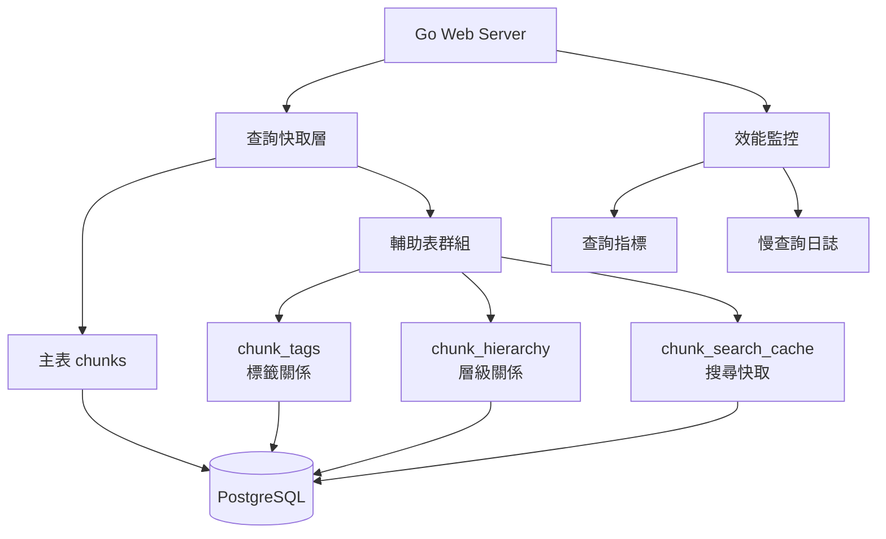
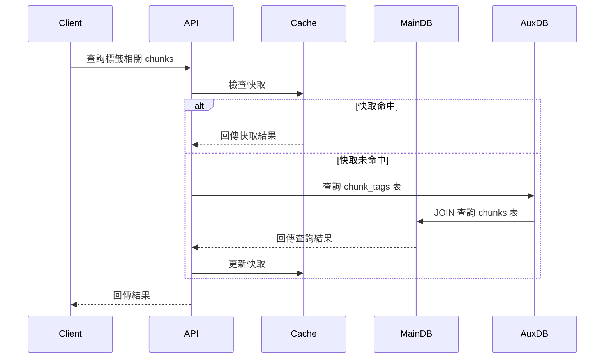

# Design Document

## Overview

這個系統重構將實現真正的統一資料表設計，所有內容（文字、標籤、模板、slots、頁面）都儲存在單一 chunks 表中。系統採用主表 + 輔助表的混合策略，在保持資料統一性的同時，透過專用輔助表和索引優化實現大資料量下的高效能查詢。

核心設計原則：

- 統一資料表：所有內容都是 chunks
- 多對多關係：透過輔助表實現高效查詢
- 效能優先：毫秒級查詢響應時間
- 資料一致性：主表和輔助表同步更新
- 可擴展性：支援新內容類型無需修改表結構

## Architecture

### 系統架構圖



### 資料流程



## Components and Interfaces

### 1. 資料庫設計

#### 主表：chunks

```sql
CREATE TABLE chunks (
    chunk_id UUID PRIMARY KEY DEFAULT gen_random_uuid(),
    contents TEXT NOT NULL,
    parent UUID REFERENCES chunks(chunk_id),
    page UUID REFERENCES chunks(chunk_id),
    is_page BOOLEAN DEFAULT FALSE,
    is_tag BOOLEAN DEFAULT FALSE,
    is_template BOOLEAN DEFAULT FALSE,
    is_slot BOOLEAN DEFAULT FALSE,
    ref TEXT,
    tags JSONB, -- 標籤 chunk_id 陣列，用於備用查詢
    metadata JSONB, -- 擴展欄位，支援未來新功能
    created_time TIMESTAMP WITH TIME ZONE DEFAULT NOW(),
    last_updated TIMESTAMP WITH TIME ZONE DEFAULT NOW()
);

-- 主表索引
CREATE INDEX idx_chunks_is_page ON chunks(is_page) WHERE is_page = true;
CREATE INDEX idx_chunks_is_tag ON chunks(is_tag) WHERE is_tag = true;
CREATE INDEX idx_chunks_is_template ON chunks(is_template) WHERE is_template = true;
CREATE INDEX idx_chunks_is_slot ON chunks(is_slot) WHERE is_slot = true;
CREATE INDEX idx_chunks_parent ON chunks(parent);
CREATE INDEX idx_chunks_page ON chunks(page);
CREATE INDEX idx_chunks_contents_fts ON chunks USING gin(to_tsvector('english', contents));
CREATE INDEX idx_chunks_tags_gin ON chunks USING gin(tags);
CREATE INDEX idx_chunks_metadata_gin ON chunks USING gin(metadata);
CREATE INDEX idx_chunks_created_time ON chunks(created_time DESC);
CREATE INDEX idx_chunks_updated_time ON chunks(last_updated DESC);
```

#### 輔助表：chunk_tags (標籤關係優化)

```sql
CREATE TABLE chunk_tags (
    source_chunk_id UUID NOT NULL,
    tag_chunk_id UUID NOT NULL,
    created_at TIMESTAMP WITH TIME ZONE DEFAULT NOW(),
    
    PRIMARY KEY (source_chunk_id, tag_chunk_id),
    FOREIGN KEY (source_chunk_id) REFERENCES chunks(chunk_id) ON DELETE CASCADE,
    FOREIGN KEY (tag_chunk_id) REFERENCES chunks(chunk_id) ON DELETE CASCADE
);

-- 雙向查詢索引
CREATE INDEX idx_chunk_tags_source ON chunk_tags(source_chunk_id);
CREATE INDEX idx_chunk_tags_tag ON chunk_tags(tag_chunk_id);
CREATE INDEX idx_chunk_tags_created ON chunk_tags(created_at DESC);

-- 標籤統計視圖
CREATE MATERIALIZED VIEW tag_statistics AS
SELECT 
    tag_chunk_id,
    COUNT(*) as usage_count,
    MAX(created_at) as last_used
FROM chunk_tags 
GROUP BY tag_chunk_id;

CREATE UNIQUE INDEX idx_tag_statistics_tag ON tag_statistics(tag_chunk_id);
```

#### 輔助表：chunk_hierarchy (層級關係優化)

```sql
CREATE TABLE chunk_hierarchy (
    ancestor_id UUID NOT NULL,
    descendant_id UUID NOT NULL,
    depth INTEGER NOT NULL,
    path_ids UUID[] NOT NULL, -- 完整路徑
    
    PRIMARY KEY (ancestor_id, descendant_id),
    FOREIGN KEY (ancestor_id) REFERENCES chunks(chunk_id) ON DELETE CASCADE,
    FOREIGN KEY (descendant_id) REFERENCES chunks(chunk_id) ON DELETE CASCADE
);

-- 層級查詢索引
CREATE INDEX idx_hierarchy_ancestor ON chunk_hierarchy(ancestor_id, depth);
CREATE INDEX idx_hierarchy_descendant ON chunk_hierarchy(descendant_id, depth);
CREATE INDEX idx_hierarchy_depth ON chunk_hierarchy(depth);
CREATE INDEX idx_hierarchy_path ON chunk_hierarchy USING gin(path_ids);
```

#### 輔助表：chunk_search_cache (查詢快取)

```sql
CREATE TABLE chunk_search_cache (
    search_hash VARCHAR(64) PRIMARY KEY,
    query_params JSONB NOT NULL,
    chunk_ids UUID[] NOT NULL,
    result_count INTEGER NOT NULL,
    created_at TIMESTAMP WITH TIME ZONE DEFAULT NOW(),
    expires_at TIMESTAMP WITH TIME ZONE NOT NULL,
    hit_count INTEGER DEFAULT 0
);

CREATE INDEX idx_search_cache_expires ON chunk_search_cache(expires_at);
CREATE INDEX idx_search_cache_params ON chunk_search_cache USING gin(query_params);
```

### 2. Go 資料結構

```go
// 主要資料結構
type ChunkRecord struct {
    ChunkID     string                 `json:"chunk_id" db:"chunk_id"`
    Contents    string                 `json:"contents" db:"contents"`
    Parent      *string                `json:"parent" db:"parent"`
    Page        *string                `json:"page" db:"page"`
    IsPage      bool                   `json:"is_page" db:"is_page"`
    IsTag       bool                   `json:"is_tag" db:"is_tag"`
    IsTemplate  bool                   `json:"is_template" db:"is_template"`
    IsSlot      bool                   `json:"is_slot" db:"is_slot"`
    Ref         *string                `json:"ref" db:"ref"`
    Tags        []string               `json:"tags" db:"tags"`
    Metadata    map[string]interface{} `json:"metadata" db:"metadata"`
    CreatedTime time.Time              `json:"created_time" db:"created_time"`
    LastUpdated time.Time              `json:"last_updated" db:"last_updated"`
}

// 輔助資料結構
type ChunkTagRelation struct {
    SourceChunkID string    `json:"source_chunk_id" db:"source_chunk_id"`
    TagChunkID    string    `json:"tag_chunk_id" db:"tag_chunk_id"`
    CreatedAt     time.Time `json:"created_at" db:"created_at"`
}

type ChunkHierarchyRelation struct {
    AncestorID   string   `json:"ancestor_id" db:"ancestor_id"`
    DescendantID string   `json:"descendant_id" db:"descendant_id"`
    Depth        int      `json:"depth" db:"depth"`
    PathIDs      []string `json:"path_ids" db:"path_ids"`
}

type SearchCacheEntry struct {
    SearchHash   string                 `json:"search_hash" db:"search_hash"`
    QueryParams  map[string]interface{} `json:"query_params" db:"query_params"`
    ChunkIDs     []string               `json:"chunk_ids" db:"chunk_ids"`
    ResultCount  int                    `json:"result_count" db:"result_count"`
    CreatedAt    time.Time              `json:"created_at" db:"created_at"`
    ExpiresAt    time.Time              `json:"expires_at" db:"expires_at"`
    HitCount     int                    `json:"hit_count" db:"hit_count"`
}

// 查詢結果結構
type ChunkWithTags struct {
    Chunk *ChunkRecord   `json:"chunk"`
    Tags  []ChunkRecord  `json:"tags"`
}

type ChunkHierarchy struct {
    Chunk    *ChunkRecord     `json:"chunk"`
    Children []ChunkHierarchy `json:"children"`
    Depth    int              `json:"depth"`
    Path     []string         `json:"path"`
}

type TagStatistics struct {
    TagChunkID  string    `json:"tag_chunk_id"`
    TagContent  string    `json:"tag_content"`
    UsageCount  int       `json:"usage_count"`
    LastUsed    time.Time `json:"last_used"`
}
```

### 3. 核心服務介面

```go
// 統一 Chunk 服務
type UnifiedChunkService interface {
    // 基本 CRUD
    CreateChunk(ctx context.Context, chunk *ChunkRecord) error
    GetChunk(ctx context.Context, chunkID string) (*ChunkRecord, error)
    UpdateChunk(ctx context.Context, chunk *ChunkRecord) error
    DeleteChunk(ctx context.Context, chunkID string) error
    
    // 批量操作
    BatchCreateChunks(ctx context.Context, chunks []ChunkRecord) error
    BatchUpdateChunks(ctx context.Context, chunks []ChunkRecord) error
    
    // 標籤操作
    AddTags(ctx context.Context, chunkID string, tagChunkIDs []string) error
    RemoveTags(ctx context.Context, chunkID string, tagChunkIDs []string) error
    GetChunkTags(ctx context.Context, chunkID string) ([]ChunkRecord, error)
    GetChunksByTag(ctx context.Context, tagChunkID string) ([]ChunkRecord, error)
    GetChunksByTags(ctx context.Context, tagChunkIDs []string, matchType string) ([]ChunkRecord, error)
    
    // 層級操作
    GetChildren(ctx context.Context, parentChunkID string) ([]ChunkRecord, error)
    GetDescendants(ctx context.Context, ancestorChunkID string, maxDepth int) ([]ChunkRecord, error)
    GetAncestors(ctx context.Context, chunkID string) ([]ChunkRecord, error)
    MoveChunk(ctx context.Context, chunkID, newParentID string) error
    
    // 搜尋操作
    SearchChunks(ctx context.Context, query *SearchQuery) (*SearchResult, error)
    SearchByContent(ctx context.Context, content string, filters map[string]interface{}) ([]ChunkRecord, error)
}

// 快取服務
type CacheService interface {
    Get(ctx context.Context, key string) (interface{}, bool)
    Set(ctx context.Context, key string, value interface{}, ttl time.Duration) error
    Delete(ctx context.Context, key string) error
    DeletePattern(ctx context.Context, pattern string) error
    GetStats() CacheStats
}

// 效能監控服務
type PerformanceMonitor interface {
    RecordQuery(queryType string, duration time.Duration, rowCount int)
    RecordSlowQuery(query string, duration time.Duration, params map[string]interface{})
    GetQueryStats() QueryStatistics
    GetSlowQueries(limit int) []SlowQueryRecord
}
```

### 4. 查詢優化策略

#### 標籤查詢優化

```go
// 單標籤查詢 - 使用輔助表
func (s *UnifiedChunkService) GetChunksByTag(ctx context.Context, tagChunkID string) ([]ChunkRecord, error) {
    // 檢查快取
    cacheKey := fmt.Sprintf("chunks_by_tag:%s", tagChunkID)
    if cached, found := s.cache.Get(ctx, cacheKey); found {
        return cached.([]ChunkRecord), nil
    }
    
    query := `
        SELECT c.* FROM chunks c
        JOIN chunk_tags ct ON c.chunk_id = ct.source_chunk_id
        WHERE ct.tag_chunk_id = $1
        ORDER BY c.created_time DESC
    `
    
    chunks, err := s.queryChunks(ctx, query, tagChunkID)
    if err != nil {
        return nil, err
    }
    
    // 設定快取
    s.cache.Set(ctx, cacheKey, chunks, 5*time.Minute)
    return chunks, nil
}

// 多標籤查詢 - AND 邏輯
func (s *UnifiedChunkService) GetChunksByTagsAND(ctx context.Context, tagChunkIDs []string) ([]ChunkRecord, error) {
    query := `
        SELECT c.* FROM chunks c
        WHERE c.chunk_id IN (
            SELECT source_chunk_id 
            FROM chunk_tags 
            WHERE tag_chunk_id = ANY($1)
            GROUP BY source_chunk_id 
            HAVING COUNT(DISTINCT tag_chunk_id) = $2
        )
        ORDER BY c.created_time DESC
    `
    
    return s.queryChunks(ctx, query, pq.Array(tagChunkIDs), len(tagChunkIDs))
}

// 多標籤查詢 - OR 邏輯
func (s *UnifiedChunkService) GetChunksByTagsOR(ctx context.Context, tagChunkIDs []string) ([]ChunkRecord, error) {
    query := `
        SELECT DISTINCT c.* FROM chunks c
        JOIN chunk_tags ct ON c.chunk_id = ct.source_chunk_id
        WHERE ct.tag_chunk_id = ANY($1)
        ORDER BY c.created_time DESC
    `
    
    return s.queryChunks(ctx, query, pq.Array(tagChunkIDs))
}
```

#### 層級查詢優化

```go
// 獲取所有子項目 - 使用輔助表
func (s *UnifiedChunkService) GetDescendants(ctx context.Context, ancestorID string, maxDepth int) ([]ChunkRecord, error) {
    query := `
        SELECT c.*, ch.depth, ch.path_ids FROM chunks c
        JOIN chunk_hierarchy ch ON c.chunk_id = ch.descendant_id
        WHERE ch.ancestor_id = $1 AND ch.depth > 0
    `
    
    args := []interface{}{ancestorID}
    if maxDepth > 0 {
        query += " AND ch.depth <= $2"
        args = append(args, maxDepth)
    }
    
    query += " ORDER BY ch.depth, c.created_time"
    
    return s.queryChunksWithHierarchy(ctx, query, args...)
}

// 獲取完整路徑
func (s *UnifiedChunkService) GetAncestors(ctx context.Context, chunkID string) ([]ChunkRecord, error) {
    query := `
        SELECT c.*, ch.depth FROM chunks c
        JOIN chunk_hierarchy ch ON c.chunk_id = ch.ancestor_id
        WHERE ch.descendant_id = $1 AND ch.depth > 0
        ORDER BY ch.depth DESC
    `
    
    return s.queryChunksWithHierarchy(ctx, query, chunkID)
}
```

## Data Models

### 1. 資料庫觸發器 (維護資料一致性)

```sql
-- 自動維護 chunk_tags 輔助表
CREATE OR REPLACE FUNCTION sync_chunk_tags()
RETURNS TRIGGER AS $$
BEGIN
    IF TG_OP = 'INSERT' OR TG_OP = 'UPDATE' THEN
        -- 清除舊的標籤關係
        DELETE FROM chunk_tags WHERE source_chunk_id = NEW.chunk_id;
        
        -- 插入新的標籤關係
        IF NEW.tags IS NOT NULL THEN
            INSERT INTO chunk_tags (source_chunk_id, tag_chunk_id)
            SELECT NEW.chunk_id, tag_id::uuid
            FROM jsonb_array_elements_text(NEW.tags) AS tag_id
            WHERE tag_id ~ '^[0-9a-f]{8}-[0-9a-f]{4}-[0-9a-f]{4}-[0-9a-f]{4}-[0-9a-f]{12}$';
        END IF;
        
        RETURN NEW;
    ELSIF TG_OP = 'DELETE' THEN
        -- 清除標籤關係
        DELETE FROM chunk_tags WHERE source_chunk_id = OLD.chunk_id;
        RETURN OLD;
    END IF;
    
    RETURN NULL;
END;
$$ LANGUAGE plpgsql;

CREATE TRIGGER trigger_sync_chunk_tags
    AFTER INSERT OR UPDATE OR DELETE ON chunks
    FOR EACH ROW EXECUTE FUNCTION sync_chunk_tags();

-- 自動維護 chunk_hierarchy 輔助表
CREATE OR REPLACE FUNCTION sync_chunk_hierarchy()
RETURNS TRIGGER AS $$
BEGIN
    IF TG_OP = 'INSERT' OR TG_OP = 'UPDATE' THEN
        -- 清除舊的層級關係
        DELETE FROM chunk_hierarchy WHERE descendant_id = NEW.chunk_id;
        
        -- 重建層級關係
        WITH RECURSIVE hierarchy AS (
            -- 自己到自己的關係 (depth = 0)
            SELECT NEW.chunk_id as ancestor_id, NEW.chunk_id as descendant_id, 0 as depth, ARRAY[NEW.chunk_id] as path_ids
            
            UNION ALL
            
            -- 遞迴查找所有祖先
            SELECT h.ancestor_id, NEW.chunk_id, h.depth + 1, h.path_ids || NEW.chunk_id
            FROM hierarchy h
            JOIN chunks c ON h.ancestor_id = c.chunk_id
            WHERE c.parent IS NOT NULL AND h.depth < 100 -- 防止無限遞迴
        )
        INSERT INTO chunk_hierarchy (ancestor_id, descendant_id, depth, path_ids)
        SELECT ancestor_id, descendant_id, depth, path_ids FROM hierarchy;
        
        RETURN NEW;
    ELSIF TG_OP = 'DELETE' THEN
        -- 清除層級關係
        DELETE FROM chunk_hierarchy WHERE ancestor_id = OLD.chunk_id OR descendant_id = OLD.chunk_id;
        RETURN OLD;
    END IF;
    
    RETURN NULL;
END;
$$ LANGUAGE plpgsql;

CREATE TRIGGER trigger_sync_chunk_hierarchy
    AFTER INSERT OR UPDATE OF parent OR DELETE ON chunks
    FOR EACH ROW EXECUTE FUNCTION sync_chunk_hierarchy();
```

### 2. 查詢快取策略

```go
type QueryCacheManager struct {
    cache    CacheService
    db       *sql.DB
    monitor  PerformanceMonitor
}

func (qcm *QueryCacheManager) ExecuteWithCache(
    ctx context.Context, 
    query string, 
    params []interface{}, 
    ttl time.Duration,
) ([]ChunkRecord, error) {
    // 生成快取鍵
    cacheKey := qcm.generateCacheKey(query, params)
    
    // 檢查快取
    if cached, found := qcm.cache.Get(ctx, cacheKey); found {
        qcm.monitor.RecordQuery("cache_hit", 0, len(cached.([]ChunkRecord)))
        return cached.([]ChunkRecord), nil
    }
    
    // 執行查詢
    start := time.Now()
    result, err := qcm.executeQuery(ctx, query, params...)
    duration := time.Since(start)
    
    if err != nil {
        return nil, err
    }
    
    // 記錄效能
    qcm.monitor.RecordQuery("database_query", duration, len(result))
    
    // 設定快取
    qcm.cache.Set(ctx, cacheKey, result, ttl)
    
    return result, nil
}

func (qcm *QueryCacheManager) InvalidateCache(ctx context.Context, patterns ...string) {
    for _, pattern := range patterns {
        qcm.cache.DeletePattern(ctx, pattern)
    }
}
```

## Error Handling

### 資料一致性錯誤處理

```go
type ConsistencyChecker struct {
    db *sql.DB
}

func (cc *ConsistencyChecker) CheckTagConsistency(ctx context.Context) ([]ConsistencyError, error) {
    var errors []ConsistencyError
    
    // 檢查主表 tags 欄位與輔助表的一致性
    query := `
        SELECT c.chunk_id, c.tags, array_agg(ct.tag_chunk_id) as aux_tags
        FROM chunks c
        LEFT JOIN chunk_tags ct ON c.chunk_id = ct.source_chunk_id
        WHERE c.tags IS NOT NULL
        GROUP BY c.chunk_id, c.tags
        HAVING c.tags::jsonb != COALESCE(array_to_json(array_agg(ct.tag_chunk_id))::jsonb, '[]'::jsonb)
    `
    
    rows, err := cc.db.QueryContext(ctx, query)
    if err != nil {
        return nil, err
    }
    defer rows.Close()
    
    for rows.Next() {
        var chunkID string
        var mainTags, auxTags []string
        
        if err := rows.Scan(&chunkID, pq.Array(&mainTags), pq.Array(&auxTags)); err != nil {
            continue
        }
        
        errors = append(errors, ConsistencyError{
            Type:    "tag_mismatch",
            ChunkID: chunkID,
            Details: fmt.Sprintf("Main table tags: %v, Aux table tags: %v", mainTags, auxTags),
        })
    }
    
    return errors, nil
}

func (cc *ConsistencyChecker) RepairTagConsistency(ctx context.Context, chunkID string) error {
    tx, err := cc.db.BeginTx(ctx, nil)
    if err != nil {
        return err
    }
    defer tx.Rollback()
    
    // 從主表獲取標籤
    var tags []string
    err = tx.QueryRowContext(ctx, "SELECT tags FROM chunks WHERE chunk_id = $1", chunkID).Scan(pq.Array(&tags))
    if err != nil {
        return err
    }
    
    // 清除輔助表中的舊關係
    _, err = tx.ExecContext(ctx, "DELETE FROM chunk_tags WHERE source_chunk_id = $1", chunkID)
    if err != nil {
        return err
    }
    
    // 重新插入標籤關係
    for _, tagID := range tags {
        _, err = tx.ExecContext(ctx, 
            "INSERT INTO chunk_tags (source_chunk_id, tag_chunk_id) VALUES ($1, $2) ON CONFLICT DO NOTHING",
            chunkID, tagID)
        if err != nil {
            return err
        }
    }
    
    return tx.Commit()
}
```

## Testing Strategy

### 1. 效能測試

```go
func BenchmarkTagQuery(b *testing.B) {
    // 準備測試資料：100萬個 chunks，10萬個標籤關係
    setupLargeDataset(b)
    
    service := NewUnifiedChunkService(db, cache, monitor)
    
    b.ResetTimer()
    for i := 0; i < b.N; i++ {
        tagID := testTagIDs[i%len(testTagIDs)]
        chunks, err := service.GetChunksByTag(context.Background(), tagID)
        if err != nil {
            b.Fatal(err)
        }
        if len(chunks) == 0 {
            b.Fatal("No chunks found")
        }
    }
}

func BenchmarkMultiTagQuery(b *testing.B) {
    setupLargeDataset(b)
    service := NewUnifiedChunkService(db, cache, monitor)
    
    b.ResetTimer()
    for i := 0; i < b.N; i++ {
        tagIDs := []string{testTagIDs[i%10], testTagIDs[(i+1)%10]}
        chunks, err := service.GetChunksByTags(context.Background(), tagIDs, "AND")
        if err != nil {
            b.Fatal(err)
        }
        _ = chunks
    }
}
```

### 2. 資料一致性測試

```go
func TestDataConsistency(t *testing.T) {
    service := NewUnifiedChunkService(db, cache, monitor)
    checker := NewConsistencyChecker(db)
    
    // 創建測試資料
    chunk := &ChunkRecord{
        Contents: "Test chunk",
        Tags:     []string{"tag1", "tag2"},
    }
    
    err := service.CreateChunk(context.Background(), chunk)
    require.NoError(t, err)
    
    // 檢查一致性
    errors, err := checker.CheckTagConsistency(context.Background())
    require.NoError(t, err)
    assert.Empty(t, errors, "Should have no consistency errors")
    
    // 驗證輔助表資料
    var count int
    err = db.QueryRow("SELECT COUNT(*) FROM chunk_tags WHERE source_chunk_id = $1", chunk.ChunkID).Scan(&count)
    require.NoError(t, err)
    assert.Equal(t, 2, count, "Should have 2 tag relationships")
}
```

### 3. 快取測試

```go
func TestCacheInvalidation(t *testing.T) {
    service := NewUnifiedChunkService(db, cache, monitor)
    
    // 第一次查詢，應該查詢資料庫
    chunks1, err := service.GetChunksByTag(context.Background(), "test-tag")
    require.NoError(t, err)
    
    // 第二次查詢，應該使用快取
    chunks2, err := service.GetChunksByTag(context.Background(), "test-tag")
    require.NoError(t, err)
    assert.Equal(t, chunks1, chunks2)
    
    // 更新標籤關係
    err = service.AddTags(context.Background(), "test-chunk", []string{"test-tag"})
    require.NoError(t, err)
    
    // 快取應該被清除，查詢結果應該更新
    chunks3, err := service.GetChunksByTag(context.Background(), "test-tag")
    require.NoError(t, err)
    assert.NotEqual(t, len(chunks1), len(chunks3))
}
```

## Performance Optimization

### 1. 索引策略

```sql
-- 複合索引優化常用查詢
CREATE INDEX idx_chunks_type_created ON chunks(is_page, is_tag, is_template, is_slot, created_time DESC);
CREATE INDEX idx_chunks_page_parent ON chunks(page, parent) WHERE page IS NOT NULL;

-- 部分索引優化特定查詢
CREATE INDEX idx_chunks_active_tags ON chunks(chunk_id) WHERE is_tag = true AND last_updated > NOW() - INTERVAL '30 days';

-- 表達式索引
CREATE INDEX idx_chunks_content_length ON chunks((length(contents))) WHERE length(contents) > 1000;
```

### 2. 查詢優化

```go
// 使用 prepared statements
type PreparedQueries struct {
    getChunksByTag      *sql.Stmt
    getChunksByMultiTag *sql.Stmt
    getChildrenChunks   *sql.Stmt
}

func (pq *PreparedQueries) Init(db *sql.DB) error {
    var err error
    
    pq.getChunksByTag, err = db.Prepare(`
        SELECT c.* FROM chunks c
        JOIN chunk_tags ct ON c.chunk_id = ct.source_chunk_id
        WHERE ct.tag_chunk_id = $1
        ORDER BY c.created_time DESC
        LIMIT $2
    `)
    if err != nil {
        return err
    }
    
    // ... 其他 prepared statements
    
    return nil
}
```

### 3. 連線池優化

```go
type DatabaseConfig struct {
    MaxOpenConns    int           `env:"DB_MAX_OPEN_CONNS" envDefault:"50"`
    MaxIdleConns    int           `env:"DB_MAX_IDLE_CONNS" envDefault:"10"`
    ConnMaxLifetime time.Duration `env:"DB_CONN_MAX_LIFETIME" envDefault:"1h"`
    ConnMaxIdleTime time.Duration `env:"DB_CONN_MAX_IDLE_TIME" envDefault:"10m"`
}

func (cfg *DatabaseConfig) ConfigureDB(db *sql.DB) {
    db.SetMaxOpenConns(cfg.MaxOpenConns)
    db.SetMaxIdleConns(cfg.MaxIdleConns)
    db.SetConnMaxLifetime(cfg.ConnMaxLifetime)
    db.SetConnMaxIdleTime(cfg.ConnMaxIdleTime)
}
```

這個設計確保了在大資料量下的高效能查詢，同時保持了資料的一致性和系統的可擴展性。
