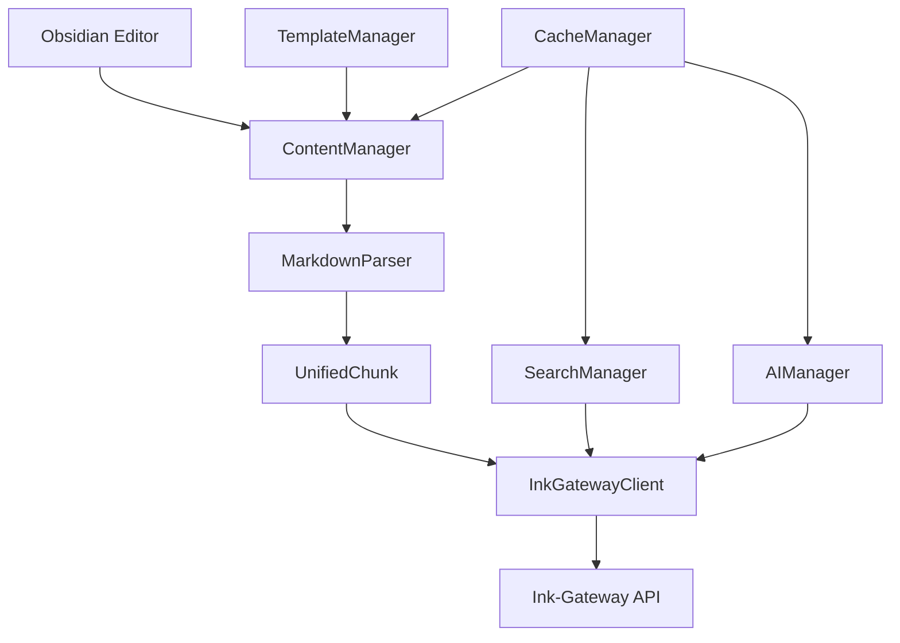

# Obsidian Ink Plugin 開發者指南

## 目錄

1. [開發環境設定](#開發環境設定)
2. [專案架構](#專案架構)
3. [API 參考](#api-參考)
4. [開發工作流程](#開發工作流程)
5. [測試指南](#測試指南)
6. [部署和發布](#部署和發布)
7. [貢獻指南](#貢獻指南)
8. [最佳實踐](#最佳實踐)

## 開發環境設定

### 系統需求

- Node.js 16.0 或更高版本
- npm 7.0 或更高版本
- TypeScript 4.7 或更高版本
- Git 2.0 或更高版本

### 開發工具建議

- **IDE**: Visual Studio Code 或 WebStorm
- **擴充套件**: 
  - TypeScript Hero
  - ESLint
  - Prettier
  - Jest Runner
- **瀏覽器**: Chrome DevTools (用於除錯)

### 專案設定

#### 1. 複製專案

```bash
git clone https://github.com/your-repo/obsidian-ink-plugin.git
cd obsidian-ink-plugin
```

#### 2. 安裝依賴

```bash
npm install
```

#### 3. 開發環境配置

```bash
# 複製環境變數範本
cp .env.example .env

# 編輯環境變數
vim .env
```

#### 4. 建置專案

```bash
# 開發建置
npm run dev

# 生產建置
npm run build
```

#### 5. 連結到 Obsidian

```bash
# 建立符號連結到 Obsidian 插件目錄
ln -s $(pwd) /path/to/obsidian/vault/.obsidian/plugins/obsidian-ink-plugin
```

### 開發伺服器

```bash
# 啟動開發模式（自動重建）
npm run dev

# 啟動測試監視模式
npm run test:watch

# 啟動 ESLint 監視模式
npm run lint:watch
```

## 專案架構

### 目錄結構

```
obsidian-ink-plugin/
├── src/                    # 原始碼
│   ├── ai/                # AI 聊天功能
│   ├── api/               # API 客戶端
│   ├── cache/             # 快取管理
│   ├── content/           # 內容處理
│   ├── errors/            # 錯誤處理
│   ├── interfaces/        # TypeScript 介面
│   ├── offline/           # 離線支援
│   ├── performance/       # 效能監控
│   ├── search/            # 搜尋功能
│   ├── settings/          # 設定管理
│   ├── template/          # 模板系統
│   ├── types/             # 類型定義
│   └── main.ts           # 插件主程式
├── tests/                 # 測試檔案
│   ├── integration/       # 整合測試
│   ├── performance/       # 效能測試
│   ├── load/             # 負載測試
│   └── mock-data/        # 測試資料
├── docs/                  # 文件
├── scripts/               # 建置腳本
└── dist/                  # 建置輸出
```

### 核心模組

#### 1. 插件主程式 (main.ts)

```typescript
export default class ObsidianInkPlugin extends Plugin {
    settings: PluginSettings;
    contentManager: IContentManager;
    searchManager: ISearchManager;
    aiManager: IAIManager;
    templateManager: ITemplateManager;
    apiClient: IInkGatewayClient;
    
    async onload() {
        // 插件初始化邏輯
    }
    
    async onunload() {
        // 插件清理邏輯
    }
}
```

#### 2. 內容管理器 (ContentManager)

負責處理 Obsidian 內容的解析、同步和管理：

```typescript
export class ContentManager implements IContentManager {
    async parseContent(content: string, filePath: string): Promise<ParsedContent>;
    async syncToInkGateway(chunks: UnifiedChunk[]): Promise<SyncResult>;
    async handleContentChange(file: TFile): Promise<void>;
}
```

#### 3. API 客戶端 (InkGatewayClient)

與 Ink-Gateway 後端服務的通訊介面：

```typescript
export class InkGatewayClient implements IInkGatewayClient {
    async createChunk(chunk: UnifiedChunk): Promise<UnifiedChunk>;
    async searchChunks(query: SearchQuery): Promise<SearchResult>;
    async chatWithAI(message: string): Promise<AIResponse>;
}
```

### 資料流程



## API 參考

### 核心介面

#### IContentManager

```typescript
interface IContentManager {
    parseContent(content: string, filePath: string): Promise<ParsedContent>;
    syncToInkGateway(chunks: UnifiedChunk[]): Promise<SyncResult>;
    handleContentChange(file: TFile): Promise<void>;
    parseHierarchy(content: string): HierarchyNode[];
    extractMetadata(file: TFile): ContentMetadata;
    generateDocumentId(filePath: string): string;
    getChunksByDocumentId(documentId: string): Promise<UnifiedChunk[]>;
    reconstructDocument(documentId: string): Promise<ReconstructedDocument>;
}
```

#### ISearchManager

```typescript
interface ISearchManager {
    performSearch(query: SearchQuery): Promise<SearchResult>;
    displayResults(results: SearchResult): void;
    navigateToResult(result: SearchResultItem): void;
    createSearchView(): SearchView;
}
```

#### IAIManager

```typescript
interface IAIManager {
    sendMessage(message: string): Promise<AIResponse>;
    processContent(content: string): Promise<ProcessingResult>;
    createChatView(): ChatView;
    maintainChatHistory(): void;
}
```

#### ITemplateManager

```typescript
interface ITemplateManager {
    createTemplate(name: string, structure: TemplateStructure): Promise<Template>;
    applyTemplate(templateId: string, targetFile: TFile): Promise<void>;
    parseTemplateFromContent(content: string): Template;
    getTemplateInstances(templateId: string): Promise<TemplateInstance[]>;
}
```

### 資料類型

#### UnifiedChunk

```typescript
interface UnifiedChunk {
    chunkId: string;
    contents: string;
    parent?: string;
    page?: string;
    isPage: boolean;
    isTag: boolean;
    isTemplate: boolean;
    isSlot: boolean;
    ref?: string;
    tags: string[];
    metadata: Record<string, any>;
    createdTime: Date;
    lastUpdated: Date;
    position: Position;
    filePath: string;
    obsidianMetadata: ObsidianMetadata;
    documentId: string;
    virtualDocumentId?: string;
    documentScope: DocumentScope;
}
```

#### SearchQuery

```typescript
interface SearchQuery {
    content?: string;
    tags?: string[];
    tagLogic?: 'AND' | 'OR';
    filters?: SearchFilters;
    searchType: 'semantic' | 'exact' | 'fuzzy';
}
```

#### Template

```typescript
interface Template {
    id: string;
    name: string;
    slots: TemplateSlot[];
    structure: TemplateStructure;
    metadata: TemplateMetadata;
}
```

### 事件系統

#### 事件類型

```typescript
type PluginEvent = 
    | 'content-changed'
    | 'sync-start'
    | 'sync-complete'
    | 'sync-error'
    | 'search-performed'
    | 'ai-response-received'
    | 'template-applied'
    | 'offline-mode-changed';
```

#### 事件監聽

```typescript
// 監聽事件
plugin.on('content-changed', (file: TFile) => {
    console.log('Content changed:', file.path);
});

// 觸發事件
plugin.trigger('sync-start');
```

## 開發工作流程

### 功能開發流程

#### 1. 需求分析

- 閱讀需求規格
- 分析技術可行性
- 設計 API 介面
- 撰寫技術設計文件

#### 2. 開發準備

```bash
# 建立功能分支
git checkout -b feature/new-feature

# 建立測試檔案
touch src/new-feature/__tests__/NewFeature.test.ts

# 建立實作檔案
touch src/new-feature/NewFeature.ts
```

#### 3. TDD 開發

```typescript
// 1. 先寫測試
describe('NewFeature', () => {
    it('should perform expected behavior', () => {
        const feature = new NewFeature();
        expect(feature.doSomething()).toBe(expectedResult);
    });
});

// 2. 實作功能
export class NewFeature {
    doSomething(): string {
        return expectedResult;
    }
}

// 3. 重構優化
```

#### 4. 整合測試

```bash
# 執行單元測試
npm run test:unit

# 執行整合測試
npm run test:integration

# 執行效能測試
npm run test:performance
```

#### 5. 程式碼審查

```bash
# 檢查程式碼品質
npm run lint
npm run type-check

# 格式化程式碼
npm run format

# 提交變更
git add .
git commit -m "feat: add new feature"
```

### Git 工作流程

#### 分支策略

- `main`: 穩定版本分支
- `develop`: 開發分支
- `feature/*`: 功能開發分支
- `hotfix/*`: 緊急修復分支
- `release/*`: 發布準備分支

#### 提交訊息規範

```
<type>(<scope>): <description>

[optional body]

[optional footer]
```

**類型**:
- `feat`: 新功能
- `fix`: 錯誤修復
- `docs`: 文件更新
- `style`: 程式碼格式
- `refactor`: 重構
- `test`: 測試相關
- `chore`: 建置或輔助工具

**範例**:
```
feat(search): add semantic search functionality

Implement semantic search using vector embeddings
- Add SearchManager class
- Integrate with Ink-Gateway API
- Add search result caching

Closes #123
```

## 測試指南

### 測試架構

#### 測試類型

1. **單元測試**: 測試個別函數和類別
2. **整合測試**: 測試模組間的互動
3. **端到端測試**: 測試完整的使用者流程
4. **效能測試**: 測試效能和負載能力

#### 測試工具

- **Jest**: 測試框架
- **@testing-library**: UI 測試工具
- **MSW**: API 模擬
- **Puppeteer**: 端到端測試

### 撰寫測試

#### 單元測試範例

```typescript
import { ContentManager } from '../ContentManager';
import { mockInkGatewayClient } from '../../__mocks__/InkGatewayClient';

describe('ContentManager', () => {
    let contentManager: ContentManager;
    
    beforeEach(() => {
        contentManager = new ContentManager(mockInkGatewayClient);
    });
    
    describe('parseContent', () => {
        it('should parse markdown content correctly', async () => {
            const content = '# Title\n\nContent paragraph';
            const result = await contentManager.parseContent(content, 'test.md');
            
            expect(result.chunks).toHaveLength(2);
            expect(result.chunks[0].contents).toBe('Title');
            expect(result.chunks[1].contents).toBe('Content paragraph');
        });
        
        it('should handle empty content', async () => {
            const result = await contentManager.parseContent('', 'empty.md');
            expect(result.chunks).toHaveLength(0);
        });
    });
});
```

#### 整合測試範例

```typescript
import { ObsidianInkPlugin } from '../main';
import { mockObsidianApp } from '../../__mocks__/obsidian';

describe('Plugin Integration', () => {
    let plugin: ObsidianInkPlugin;
    
    beforeEach(async () => {
        plugin = new ObsidianInkPlugin(mockObsidianApp, {});
        await plugin.onload();
    });
    
    afterEach(async () => {
        await plugin.onunload();
    });
    
    it('should sync content to gateway on file change', async () => {
        const mockFile = createMockFile('test.md', '# Test Content');
        
        await plugin.contentManager.handleContentChange(mockFile);
        
        expect(plugin.apiClient.createChunk).toHaveBeenCalled();
    });
});
```

#### 效能測試範例

```typescript
describe('Performance Tests', () => {
    it('should process large documents within time limit', async () => {
        const largeContent = generateLargeContent(10000); // 10k lines
        
        const startTime = performance.now();
        const result = await contentManager.parseContent(largeContent, 'large.md');
        const endTime = performance.now();
        
        expect(endTime - startTime).toBeLessThan(5000); // Under 5 seconds
        expect(result.chunks.length).toBeGreaterThan(0);
    });
});
```

### 測試執行

```bash
# 執行所有測試
npm test

# 執行特定測試檔案
npm test -- ContentManager.test.ts

# 執行測試並產生覆蓋率報告
npm run test:coverage

# 執行效能測試
npm run test:performance

# 執行負載測試
npm run test:load
```

### 測試覆蓋率

目標覆蓋率：
- 行覆蓋率: ≥ 80%
- 函數覆蓋率: ≥ 80%
- 分支覆蓋率: ≥ 80%
- 語句覆蓋率: ≥ 80%

## 部署和發布

### 建置流程

#### 開發建置

```bash
# 開發模式建置
npm run dev

# 監視模式（自動重建）
npm run dev:watch
```

#### 生產建置

```bash
# 生產建置
npm run build

# 建置並壓縮
npm run build:prod

# 驗證建置
npm run build:verify
```

### 版本管理

#### 語義化版本

遵循 [Semantic Versioning](https://semver.org/) 規範：

- `MAJOR.MINOR.PATCH`
- `1.0.0`: 主要版本（破壞性變更）
- `1.1.0`: 次要版本（新功能）
- `1.1.1`: 修補版本（錯誤修復）

#### 版本更新

```bash
# 更新版本號
npm run version:patch   # 1.0.0 -> 1.0.1
npm run version:minor   # 1.0.0 -> 1.1.0
npm run version:major   # 1.0.0 -> 2.0.0

# 手動更新
npm version patch
```

### 發布流程

#### 1. 準備發布

```bash
# 確保在 main 分支
git checkout main
git pull origin main

# 執行完整測試
npm run test:ci

# 建置生產版本
npm run build:prod
```

#### 2. 建立發布

```bash
# 更新版本
npm run version:patch

# 建立 Git 標籤
git tag v1.0.1

# 推送到遠端
git push origin main --tags
```

#### 3. GitHub Release

1. 前往 GitHub Releases 頁面
2. 點擊 "Create a new release"
3. 選擇版本標籤
4. 撰寫發布說明
5. 上傳建置檔案
6. 發布版本

#### 4. Obsidian 社群插件

1. 更新 `manifest.json`
2. 更新 `versions.json`
3. 提交 PR 到 Obsidian 插件倉庫

### CI/CD 流程

#### GitHub Actions

```yaml
name: CI/CD Pipeline

on:
  push:
    branches: [main, develop]
  pull_request:
    branches: [main]

jobs:
  test:
    runs-on: ubuntu-latest
    steps:
      - uses: actions/checkout@v3
      - uses: actions/setup-node@v3
        with:
          node-version: '16'
      - run: npm ci
      - run: npm run lint
      - run: npm run test:ci
      - run: npm run build
      
  release:
    needs: test
    runs-on: ubuntu-latest
    if: github.ref == 'refs/heads/main'
    steps:
      - uses: actions/checkout@v3
      - run: npm run build:prod
      - uses: actions/upload-artifact@v3
        with:
          name: plugin-build
          path: dist/
```

## 貢獻指南

### 貢獻流程

#### 1. 準備工作

```bash
# Fork 專案到您的 GitHub 帳號
# Clone 您的 fork
git clone https://github.com/your-username/obsidian-ink-plugin.git

# 新增上游遠端
git remote add upstream https://github.com/original-repo/obsidian-ink-plugin.git
```

#### 2. 開發流程

```bash
# 同步上游變更
git fetch upstream
git checkout main
git merge upstream/main

# 建立功能分支
git checkout -b feature/your-feature

# 開發和測試
# ... 進行開發 ...

# 提交變更
git add .
git commit -m "feat: add your feature"
git push origin feature/your-feature
```

#### 3. 提交 Pull Request

1. 前往 GitHub 建立 PR
2. 填寫 PR 模板
3. 等待程式碼審查
4. 根據回饋修改
5. 合併到主分支

### 程式碼規範

#### TypeScript 規範

```typescript
// 使用明確的類型註解
function processContent(content: string): Promise<ParsedContent> {
    // 實作
}

// 使用介面定義複雜類型
interface ProcessingOptions {
    enableCache: boolean;
    timeout: number;
}

// 使用泛型提高重用性
class Manager<T extends BaseItem> {
    items: T[] = [];
    
    add(item: T): void {
        this.items.push(item);
    }
}
```

#### 命名規範

- **類別**: PascalCase (`ContentManager`)
- **函數**: camelCase (`parseContent`)
- **變數**: camelCase (`chunkData`)
- **常數**: UPPER_SNAKE_CASE (`MAX_RETRY_COUNT`)
- **介面**: PascalCase with I prefix (`IContentManager`)
- **類型**: PascalCase (`SearchResult`)

#### 註解規範

```typescript
/**
 * 解析 Markdown 內容並建立統一區塊
 * 
 * @param content - 要解析的 Markdown 內容
 * @param filePath - 檔案路徑，用於生成位置資訊
 * @returns Promise 包含解析結果
 * 
 * @example
 * ```typescript
 * const result = await parseContent('# Title\nContent', 'test.md');
 * console.log(result.chunks.length); // 2
 * ```
 */
async parseContent(content: string, filePath: string): Promise<ParsedContent> {
    // 實作
}
```

### 文件貢獻

#### 文件類型

1. **API 文件**: 自動從程式碼生成
2. **使用者指南**: 面向終端使用者
3. **開發者指南**: 面向開發者
4. **範例和教學**: 實際使用案例

#### 文件撰寫規範

- 使用清晰的標題結構
- 提供實際的程式碼範例
- 包含螢幕截圖（如適用）
- 保持內容更新
- 支援多語言（中文/英文）

## 最佳實踐

### 程式碼品質

#### 1. SOLID 原則

```typescript
// Single Responsibility Principle
class ContentParser {
    parse(content: string): ParsedContent {
        // 只負責解析內容
    }
}

class ContentSyncer {
    sync(chunks: UnifiedChunk[]): Promise<void> {
        // 只負責同步
    }
}

// Dependency Inversion Principle
class ContentManager {
    constructor(
        private parser: IContentParser,
        private syncer: IContentSyncer
    ) {}
}
```

#### 2. 錯誤處理

```typescript
// 使用自定義錯誤類型
class PluginError extends Error {
    constructor(
        message: string,
        public code: string,
        public recoverable: boolean = true
    ) {
        super(message);
        this.name = 'PluginError';
    }
}

// 統一錯誤處理
async function safeOperation<T>(
    operation: () => Promise<T>,
    fallback?: T
): Promise<T> {
    try {
        return await operation();
    } catch (error) {
        logger.error('Operation failed', error);
        if (fallback !== undefined) {
            return fallback;
        }
        throw error;
    }
}
```

#### 3. 效能最佳化

```typescript
// 使用快取避免重複計算
class CachedProcessor {
    private cache = new Map<string, ProcessedResult>();
    
    async process(input: string): Promise<ProcessedResult> {
        if (this.cache.has(input)) {
            return this.cache.get(input)!;
        }
        
        const result = await this.expensiveOperation(input);
        this.cache.set(input, result);
        return result;
    }
}

// 使用防抖避免頻繁操作
const debouncedSync = debounce(
    (chunks: UnifiedChunk[]) => syncToGateway(chunks),
    1000
);
```

### 安全性

#### 1. 輸入驗證

```typescript
function validateChunk(chunk: unknown): chunk is UnifiedChunk {
    return (
        typeof chunk === 'object' &&
        chunk !== null &&
        typeof (chunk as any).chunkId === 'string' &&
        typeof (chunk as any).contents === 'string'
    );
}
```

#### 2. API 安全

```typescript
class SecureApiClient {
    private apiKey: string;
    
    private getHeaders(): Record<string, string> {
        return {
            'Authorization': `Bearer ${this.apiKey}`,
            'Content-Type': 'application/json',
            'X-Plugin-Version': PLUGIN_VERSION
        };
    }
    
    async request(url: string, options: RequestInit): Promise<Response> {
        const secureOptions = {
            ...options,
            headers: {
                ...options.headers,
                ...this.getHeaders()
            }
        };
        
        return fetch(url, secureOptions);
    }
}
```

### 可維護性

#### 1. 模組化設計

```typescript
// 清晰的模組邊界
export interface ISearchManager {
    search(query: SearchQuery): Promise<SearchResult>;
}

export interface ICacheManager {
    get<T>(key: string): T | null;
    set<T>(key: string, value: T): void;
}

// 依賴注入
export class SearchManager implements ISearchManager {
    constructor(
        private apiClient: IInkGatewayClient,
        private cache: ICacheManager
    ) {}
}
```

#### 2. 配置管理

```typescript
// 集中配置管理
export const CONFIG = {
    API: {
        TIMEOUT: 30000,
        RETRY_COUNT: 3,
        BASE_URL: 'http://localhost:8080'
    },
    CACHE: {
        MAX_SIZE: 100,
        TTL: 300000 // 5 minutes
    },
    SYNC: {
        INTERVAL: 5000,
        BATCH_SIZE: 50
    }
} as const;
```

#### 3. 日誌和監控

```typescript
// 結構化日誌
class Logger {
    info(component: string, operation: string, message: string, data?: any): void {
        console.log(JSON.stringify({
            level: 'info',
            timestamp: new Date().toISOString(),
            component,
            operation,
            message,
            data
        }));
    }
}

// 效能監控
class PerformanceMonitor {
    private metrics = new Map<string, number[]>();
    
    time<T>(operation: string, fn: () => Promise<T>): Promise<T> {
        const start = performance.now();
        return fn().finally(() => {
            const duration = performance.now() - start;
            this.recordMetric(operation, duration);
        });
    }
}
```

---

**版本**: 1.0.0  
**最後更新**: 2024年1月  
**文件語言**: 繁體中文